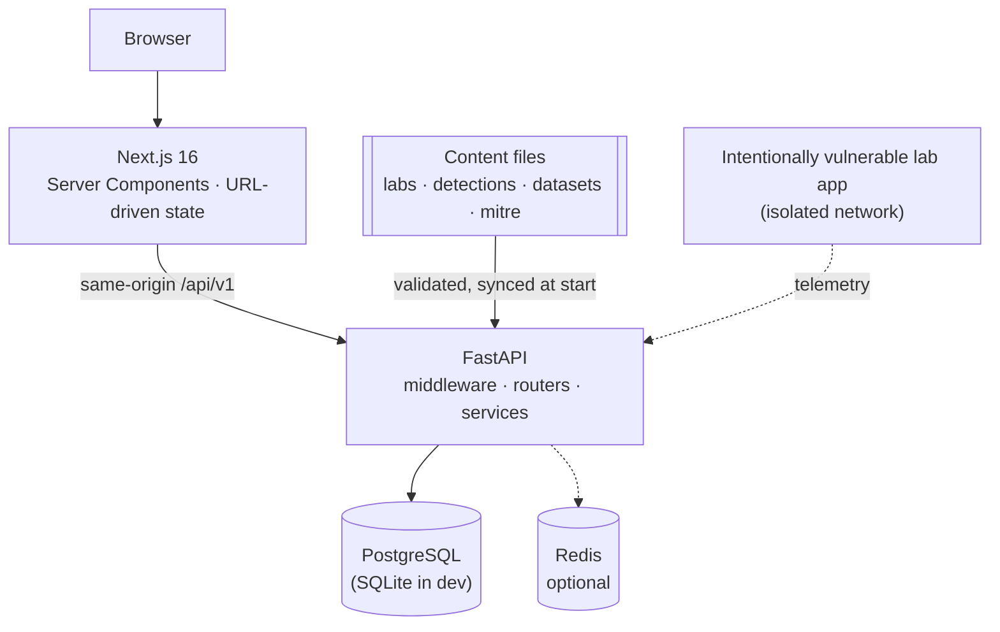

# CyberForge architecture

A short tour. The long version, with diagrams for the content pipeline, detection engine, data model and testing strategy, is in [docs/architecture.md](docs/architecture.md).



## The lifecycle is the spine

```text
Attack simulation → Telemetry → Detection → SOC alert → MITRE mapping → Investigation → Mitigation
```

1. A lab's `telemetry/scenario.jsonl` describes events in Sigma's field vocabulary. **Replaying** it (or receiving events from a lab container) produces normalised events with a realistic raw log line.
2. The **Sigma engine** evaluates enabled rules, including correlations, and returns which fields matched which patterns.
3. Hits become aggregated **alerts** with a primary MITRE technique and evidence events.
4. Analysts triage alerts, group them into **investigations**, add notes and a timeline, and export a **report**.
5. The **lifecycle view** reads all of this back for one alert: the same data, in order.

## Layers

| Layer                    | Path                           | Responsibility                                                                                                                            |
| ------------------------ | ------------------------------ | ----------------------------------------------------------------------------------------------------------------------------------------- |
| Content schemas & loader | `apps/api/cyberforge/content`  | Validate repository files, cross-check references.                                                                                        |
| Services                 | `apps/api/cyberforge/services` | Telemetry, Sigma engine/service, detection, simulation, seeding, lifecycle, coverage, dashboard, reports, guardrails.                     |
| API                      | `apps/api/cyberforge/api/v1`   | Thin, typed routers.                                                                                                                      |
| Persistence              | `models`, `migrations`         | SQLAlchemy 2 models, Alembic migrations.                                                                                                  |
| AI                       | `apps/api/cyberforge/ai`       | Provider abstraction and the defensive analyst prompt. Optional.                                                                          |
| Web                      | `apps/web/src`                 | App Router pages, components, small client hooks.                                                                                         |
| Design system            | `packages/ui`                  | Primitives and tokens.                                                                                                                    |
| Localization             | `apps/web/src/lib/i18n`        | English and Turkish: typed messages, sentence-keyed copy, a reviewed content catalogue; see [docs/localization.md](docs/localization.md). |

## Security posture in one paragraph

Local-first and single-user by design. Simulations send no packets; the only vulnerable service is isolated on an internal Docker network and reachable through a `127.0.0.1` gateway; containers are non-root, read-only with capabilities dropped; the API sets strict headers, validates every input, checks Origin on state-changing requests, rate-limits, and refuses to start in production with placeholder secrets. Full details: [docs/security-model.md](docs/security-model.md).
