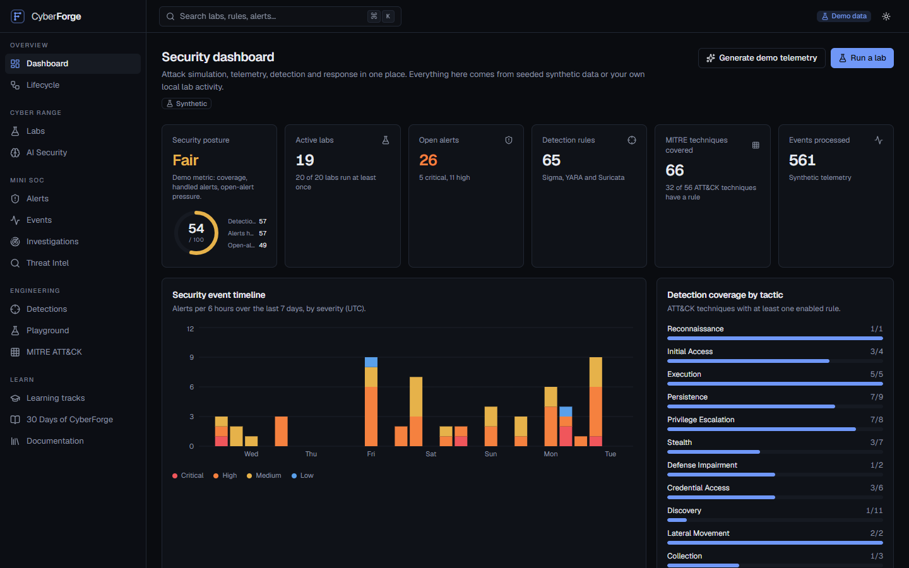
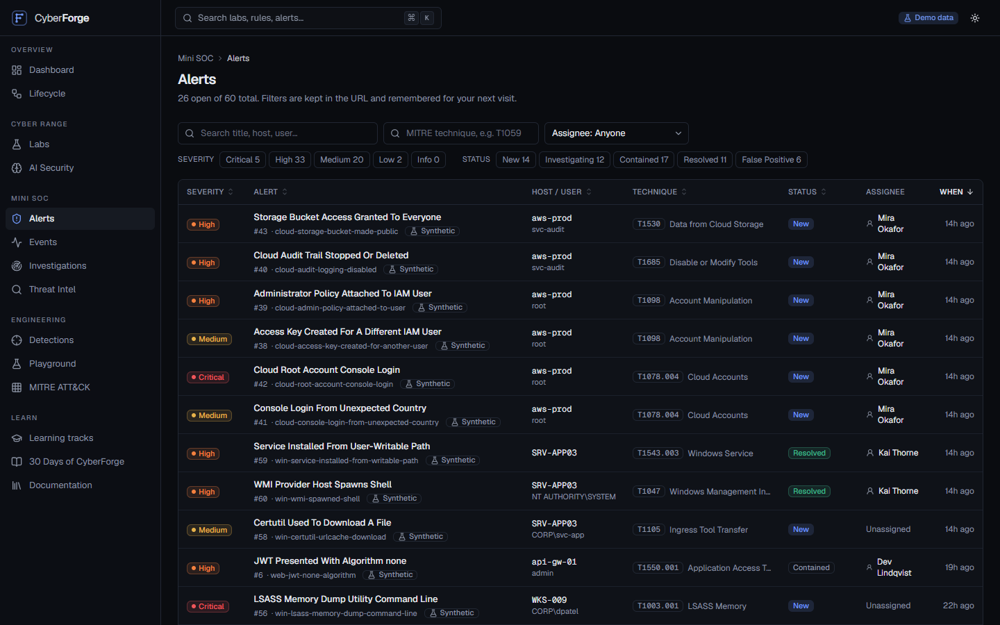
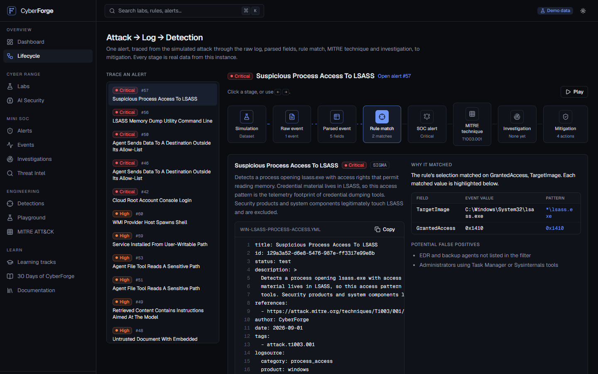
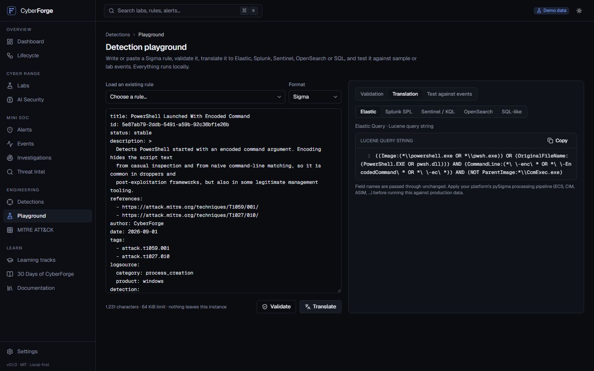
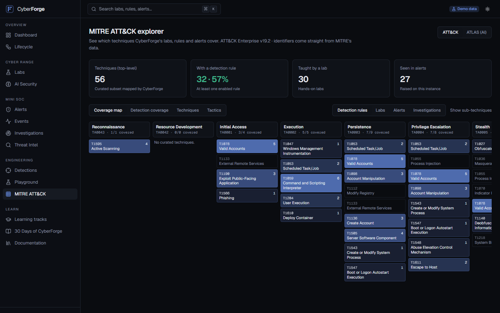
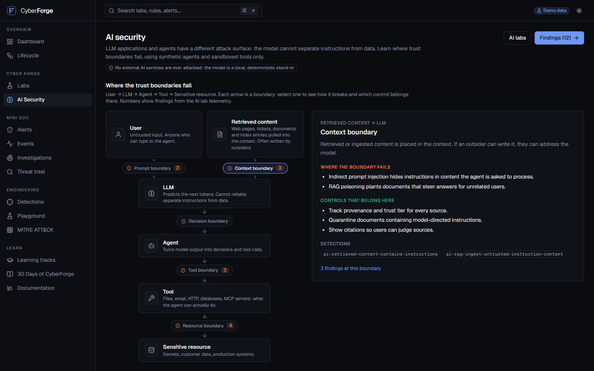
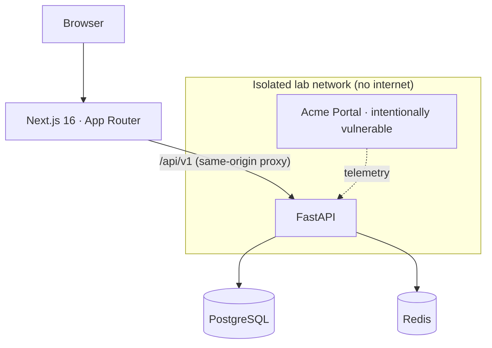

<div align="center">


# CyberForge

**The Open Cybersecurity Lab**

Learn. Simulate. Detect. Investigate. Defend.

[](https://github.com/rahmankutlu/cyberforge/actions/workflows/ci.yml)
[](https://github.com/rahmankutlu/cyberforge/actions/workflows/codeql.yml)
[](LICENSE)
[](https://github.com/rahmankutlu/cyberforge/releases)

</div>

---

CyberForge is an open-source, local-first cybersecurity lab for blue-team practice. It joins four things that are usually taught in isolation: a **cyber range**, a **mini SOC**, **detection engineering** (Sigma, YARA, Suricata) and **MITRE ATT&CK** mapping, and adds an **AI security** section and an optional AI SOC analyst.

Every simulated attack is followed all the way through, so you can see what it leaves behind and how a defender finds it:

```text
Simulation
    ↓
Telemetry
    ↓
Detection
    ↓
SOC Alert
    ↓
MITRE ATT&CK
    ↓
Investigation
    ↓
Mitigation
```

That lifecycle has its own interactive view. Pick any alert and step through the simulated attack, the raw log line (with the rule's matched values highlighted), the parsed fields, the Sigma rule that fired and why, the technique it maps to, the investigation and the mitigation.

## Quick start

```bash
git clone https://github.com/rahmankutlu/cyberforge.git
cd cyberforge
cp .env.example .env
docker compose up --build
```

|                        |                            |
| ---------------------- | -------------------------- |
| **Web app**            | http://localhost:3000      |
| **API**                | http://localhost:8000      |
| **API docs (OpenAPI)** | http://localhost:8000/docs |

The database is seeded automatically with synthetic labs, telemetry, alerts, incidents and threat intelligence, so the platform is useful the moment it starts. No account, API key or internet connection is required.

Prefer no Docker? See [Getting started](docs/getting-started.md): the API runs on SQLite with `pnpm dev:api` and the web app with `pnpm dev:web`.

Want the vulnerable lab containers too? `docker compose --profile labs up --build`. They run on an isolated network with no internet access and are reachable only on `127.0.0.1`.

## What you get

|                              |                                                                                                                                                                                                                                                      |
| ---------------------------- | ---------------------------------------------------------------------------------------------------------------------------------------------------------------------------------------------------------------------------------------------------- |
| **Cyber range**              | 20 safe labs across web, API, Linux, Windows, network, cloud and AI security. Each has objectives, architecture, scenario, telemetry, a safe attack simulation, expected detections, MITRE mapping, investigation questions, mitigation and cleanup. |
| **Attack → Log → Detection** | An interactive eight-stage lifecycle view: simulation, raw event, parsed event, rule match, SOC alert, MITRE technique, investigation, mitigation.                                                                                                   |
| **Mini SOC**                 | Alert queue with filters and sorting, alert detail, analyst notes, assignment, investigations with timelines, and incident reports exported as Markdown or JSON.                                                                                     |
| **Detection workbench**      | 55 Sigma rules (including correlations), 5 YARA rules and 5 Suricata rules, a playground that validates, translates and tests rules, and a real evaluation engine.                                                                                   |
| **Sigma translation**        | Elastic (Lucene), Splunk SPL, Microsoft Sentinel KQL, OpenSearch and a generic SQL-like form, via [pySigma](https://github.com/SigmaHQ/pySigma).                                                                                                     |
| **MITRE ATT&CK explorer**    | A coverage heatmap, detection gaps and technique pages built from official ATT&CK v19 data, plus MITRE ATLAS for AI systems.                                                                                                                         |
| **AI security**              | Prompt injection, indirect injection, RAG poisoning, tool abuse and MCP misconfiguration, taught with synthetic agents and a trust-boundary model.                                                                                                   |
| **AI SOC analyst**           | Optional, advisory-only analysis of an alert through OpenAI-compatible APIs, Gemini or Ollama. It never executes anything.                                                                                                                           |
| **Threat intel workspace**   | Local indicators (IP, domain, URL, SHA-256, email, CVE, ASN) with tags, confidence and related alerts. Nothing is ever sent to a third party.                                                                                                        |
| **Learning**                 | Six tracks, and _30 Days of CyberForge_. Progress is kept in your browser: no account.                                                                                                                                                               |
| **Contributor friendly**     | Labs and rules are plain files. `pnpm validate:content` checks schemas, Sigma syntax, MITRE identifiers, scenario correctness and links.                                                                                                             |

## Screenshots

### Dashboard

<picture>
  <source media="(prefers-color-scheme: light)" srcset="docs/assets/screenshots/dashboard-light.png">
  
</picture>

### Mini SOC

<picture>
  <source media="(prefers-color-scheme: light)" srcset="docs/assets/screenshots/alerts-light.png">
  
</picture>

### Attack → Log → Detection

<picture>
  <source media="(prefers-color-scheme: light)" srcset="docs/assets/screenshots/lifecycle-light.png">
  
</picture>

### Detection workbench

<picture>
  <source media="(prefers-color-scheme: light)" srcset="docs/assets/screenshots/detection-playground-light.png">
  
</picture>

### MITRE ATT&CK explorer

<picture>
  <source media="(prefers-color-scheme: light)" srcset="docs/assets/screenshots/mitre-light.png">
  
</picture>

### AI security lab

<picture>
  <source media="(prefers-color-scheme: light)" srcset="docs/assets/screenshots/ai-security-light.png">
  
</picture>

## The labs

|   # | Lab                                                                                                       | Focus      | Detections that fire                                              |
| --: | --------------------------------------------------------------------------------------------------------- | ---------- | ----------------------------------------------------------------- |
|  01 | [Broken Authentication](labs/web/broken-authentication)                                                   | Web        | Failed-login burst                                                |
|  02 | [SQL Injection Fundamentals](labs/web/sql-injection-fundamentals)                                         | Web        | SQLi probes, scanner user agent                                   |
|  03 | [Cross-Site Scripting](labs/web/cross-site-scripting)                                                     | Web        | XSS payloads                                                      |
|  04 | [IDOR / Broken Access Control](labs/web/idor-broken-access-control)                                       | Web        | Object-ID enumeration                                             |
|  05 | [JWT Misconfiguration](labs/api/jwt-misconfiguration)                                                     | API        | `alg: none` tokens                                                |
|  06 | [Secrets Exposure](labs/web/secrets-exposure)                                                             | Web        | Sensitive-file probes, secrets in URLs                            |
|  07 | [API Rate Limit Misconfiguration](labs/api/api-rate-limit-misconfiguration)                               | API        | Request flood                                                     |
|  08 | [Docker Security Misconfiguration](labs/linux/docker-security-misconfiguration)                           | Containers | Privileged start, Docker socket                                   |
|  09 | [Linux Authentication Investigation](labs/linux/linux-authentication-investigation)                       | Linux      | 7 rules across the intrusion chain                                |
|  10 | [Suspicious PowerShell Detection Simulation](labs/windows-sim/suspicious-powershell-detection-simulation) | Windows    | 6 rules: parent-child, encoded, cradle, script block, persistence |
|  11 | [Network Reconnaissance Detection](labs/network/network-reconnaissance-detection)                         | Network    | Port scan (distinct ports)                                        |
|  12 | [DNS Anomaly Investigation](labs/network/dns-anomaly-investigation)                                       | Network    | DGA, NXDOMAIN burst, DNS tunnelling                               |
|  13 | [Web Shell Telemetry Analysis](labs/windows-sim/web-shell-telemetry-analysis)                             | Windows    | File drop, command request, shell spawn                           |
|  14 | [Brute Force Detection](labs/windows-sim/brute-force-detection)                                           | Windows    | Guessing, spraying, RDP, backdoor admin, log clear                |
|  15 | [Cloud Audit Log Investigation](labs/cloud/cloud-audit-log-investigation)                                 | Cloud      | 6 rules: root login to public bucket                              |
|  16 | [Prompt Injection](labs/ai-security/prompt-injection)                                                     | AI         | Override attempt, system-prompt canary                            |
|  17 | [Indirect Prompt Injection](labs/ai-security/indirect-prompt-injection)                                   | AI         | Injected retrieval, blocked exfiltration                          |
|  18 | [RAG Poisoning Concepts](labs/ai-security/rag-poisoning-concepts)                                         | AI         | Poisoned ingestion and retrieval                                  |
|  19 | [Tool Abuse in AI Agents](labs/ai-security/tool-abuse-in-ai-agents)                                       | AI         | Sensitive path, off-list tool, egress                             |
|  20 | [MCP Security Misconfiguration](labs/ai-security/mcp-security-misconfiguration)                           | AI         | Unauthenticated tool server                                       |

Every lab is a directory of plain files, `lab.yaml` plus `README.md` and `telemetry/`, and each lab's simulated telemetry is **tested to trigger exactly the detections it declares**. See [Labs](docs/labs.md).

## Detection engineering

Rules live in [`detections/`](detections) as ordinary Sigma, YARA and Suricata files. CyberForge evaluates the Sigma rules with its own engine on top of pySigma's parsed rule tree (typed values, modifiers, `1 of selection_*`, `not`, and the correlation types `event_count`, `value_count`, `temporal` and `temporal_ordered`), so a lab does not just _describe_ a detection: it runs one.

```yaml
title: Burst Of Failed Logons From One Source
correlation:
  type: event_count
  rules: [failed_logon]
  group-by: [IpAddress]
  timespan: 5m
  condition: { gte: 10 }
level: high
tags: [attack.t1110.001]
```

The [playground](docs/detections.md) validates a rule (syntax, fields read, MITRE identifiers, lint warnings), translates it to five targets, and tests it against your own JSON events or any lab scenario. Every shipped rule documents its false positives, and the near-miss datasets prove the rules stay quiet on benign activity.

## MITRE ATT&CK integration

Technique and tactic data is generated from MITRE's official STIX and ATLAS releases by [`scripts/build_mitre_data.py`](scripts/build_mitre_data.py), which **fails if any identifier in the curated list does not exist upstream**, so CyberForge cannot ship an invented technique ID. Labs, rules, alerts and investigations all map to techniques, and the explorer shows the coverage that results. See [MITRE](docs/mitre.md).

## AI security

The [AI security](docs/ai-security.md) section models an agent as `User → LLM → Agent → Tool → Sensitive resource`, with retrieved content feeding the model, and marks each arrow as a trust boundary: how it fails, which control belongs there, and which detection watches it. Five labs use synthetic agents and sandboxed tools; the model is a deterministic local stand-in. **Nothing in CyberForge attacks an external AI service.**

The optional **Analyze with AI** button sends one alert to a provider you configure. It is designed defensively: the model is offered **no tools**, alert data is quoted to it as untrusted evidence, its output is validated against a fixed schema and rendered as plain text, it is clearly labelled AI-generated, and **nothing it suggests is ever executed**. The platform works fully without it.

## Architecture



Content (labs, rules, datasets, MITRE data, learning tracks) lives in the repository as validated files and is synced into PostgreSQL on start-up; the API replays scenario telemetry, runs the Sigma engine, and creates aggregated alerts; the web app renders everything with Server Components and URL-driven filters. Read [Architecture](docs/architecture.md) for the full picture.

## Safety boundaries

CyberForge is built for **local labs, owned environments and education**. It contains no exploitation of real systems, credential theft, persistence, malware, evasion tooling or internet-scale scanning, and it is deliberately hard to point at anything else:

- **Simulations replay telemetry.** They send no packets. Optional simulation targets must be `localhost`, a private address or `*.lab.internal`; URLs, ports, credentials and external addresses are rejected, and names are never resolved.
- **Vulnerable services are isolated.** The one intentionally vulnerable container runs read-only, non-root, with all capabilities dropped, on a Docker network marked `internal` (no internet), reachable only through a gateway bound to `127.0.0.1`.
- **Everything is labelled.** Synthetic data is marked as synthetic; addresses come from RFC 1918 and RFC 5737 ranges and domains from reserved names.
- **No account, no cloud.** No telemetry, indicators or usage data leave your machine, unless you opt in to AI analysis with a provider you chose.

Details, threat model and hardening notes: [Security model](docs/security-model.md). To report a vulnerability, see [SECURITY.md](SECURITY.md).

## Repository layout

```text
cyberforge/
├── apps/
│   ├── web/            Next.js 16 app (TypeScript strict, Tailwind v4)
│   └── api/            FastAPI service (Python 3.12, SQLAlchemy 2, Alembic)
├── packages/
│   ├── ui/             Design-system primitives (shadcn/ui-style on Radix)
│   ├── types/          TypeScript types for the API
│   ├── config/         Shared tsconfig / ESLint configuration
│   └── security-content/  Learning tracks, 30-day plan, threat intel, AI trust model
├── labs/               20 labs + the vulnerable lab app
├── detections/         sigma/  yara/  suricata/
├── datasets/           Synthetic background telemetry (deterministically generated)
├── mitre/              ATT&CK and ATLAS data (generated from the official releases)
├── examples/incidents/ Ten synthetic incidents
├── docs/  docker/  scripts/  .github/
```

## Development

```bash
pnpm install
python -m venv apps/api/.venv && apps/api/.venv/bin/pip install -e "apps/api[dev]"   # Scripts\pip on Windows

pnpm dev:api          # http://localhost:8000  (SQLite, auto-seeded)
pnpm dev:web          # http://localhost:3000

pnpm test             # Vitest + Pytest
pnpm test:e2e         # Playwright (builds the web app, starts a fresh API)
pnpm lint && pnpm typecheck && pnpm typecheck:api
pnpm validate:content # labs, Sigma, MITRE IDs, scenarios, links
```

CI runs lint, type checks, Pytest, Vitest, Playwright, content validation, CodeQL and dependency review; see [CONTRIBUTING.md](CONTRIBUTING.md).

## Roadmap

Next up: a real Linux/Windows telemetry collector for live labs, Sigma pipelines per SIEM, more labs and rules, PDF export, and per-user accounts. See [ROADMAP.md](ROADMAP.md).

## Contributing

Labs, rules, translations and fixes are very welcome, and adding content is designed to be easy: a lab is a folder of files and `pnpm validate:content` tells you what is wrong. Start with [CONTRIBUTING.md](CONTRIBUTING.md) and [Contributing labs](docs/contributing-labs.md), and please follow the [Code of Conduct](CODE_OF_CONDUCT.md).

## License

Software and documentation are released under the [MIT License](LICENSE). Educational content (labs, lessons and detection rules) is provided under the same license so it can be reused freely. MITRE ATT&CK® and ATLAS™ data is © The MITRE Corporation and used under its terms; see [NOTICE.md](NOTICE.md) for this and other third-party attributions.
