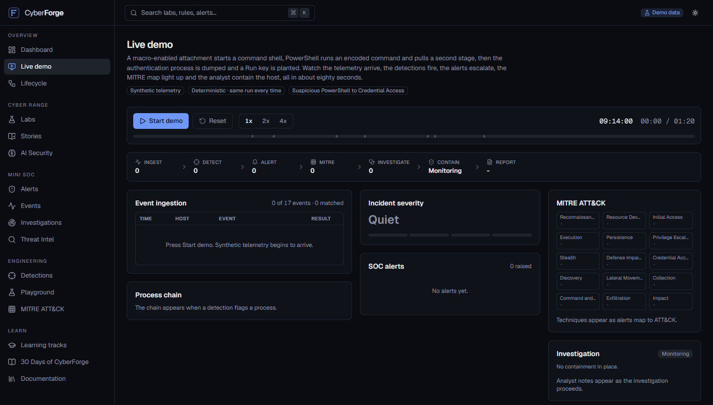
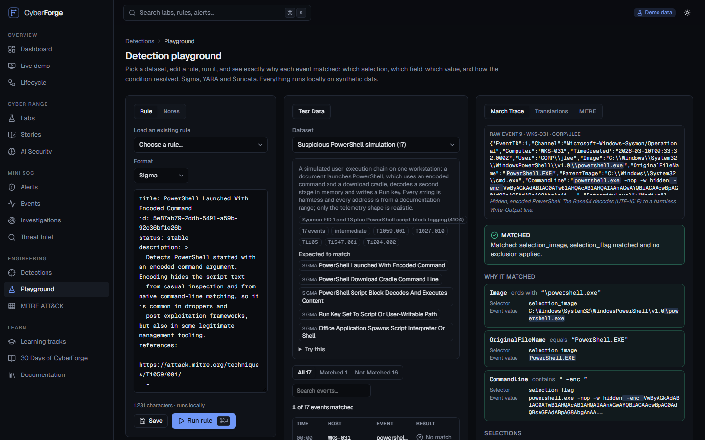
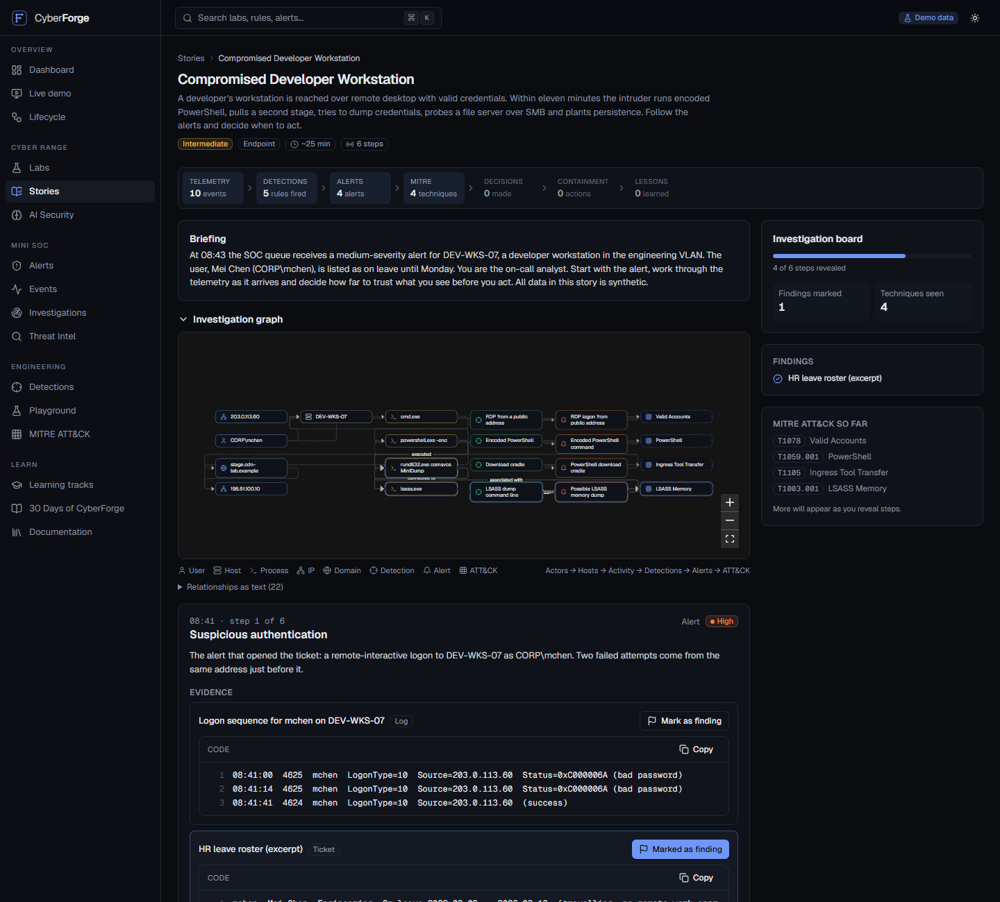
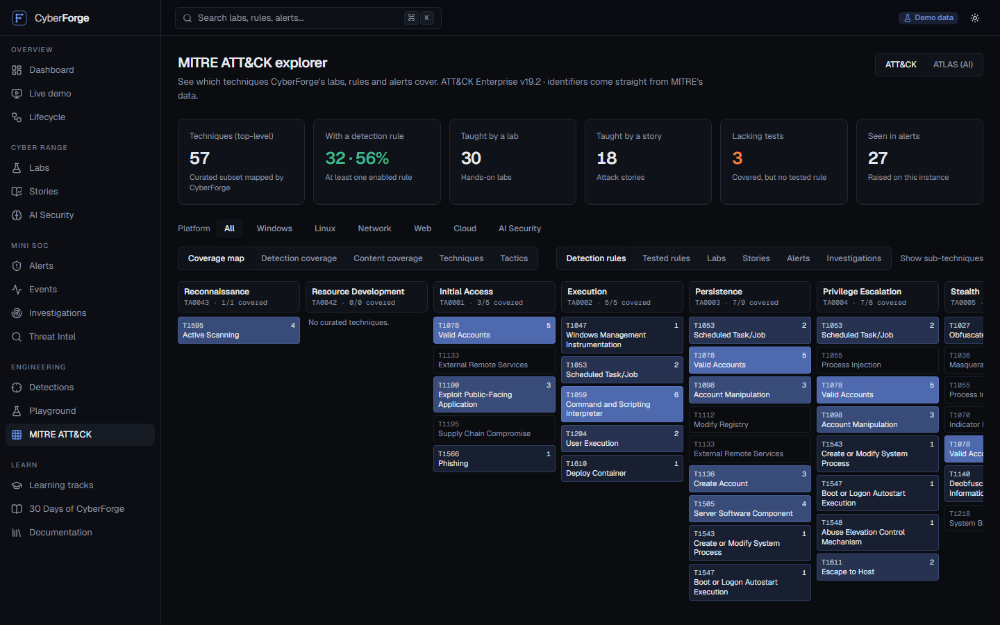
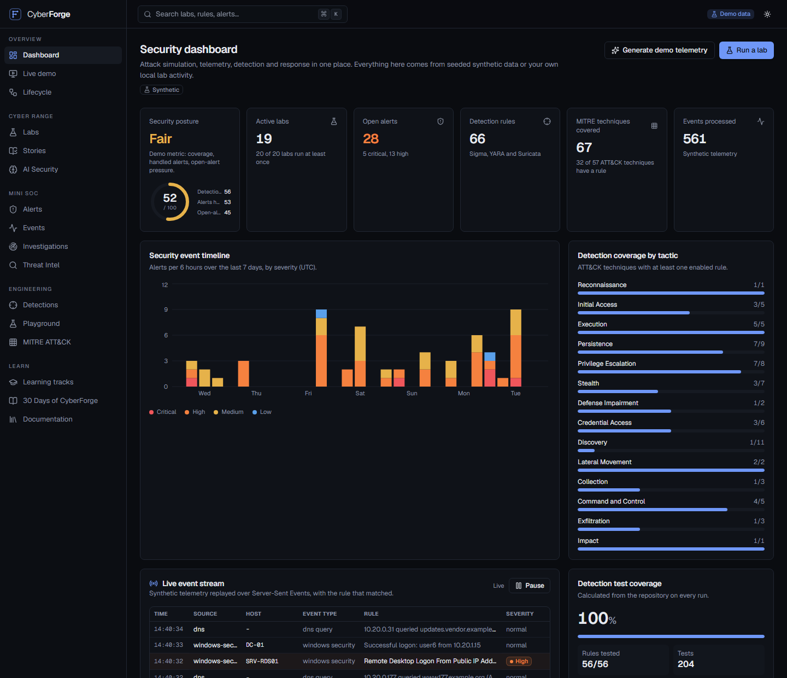
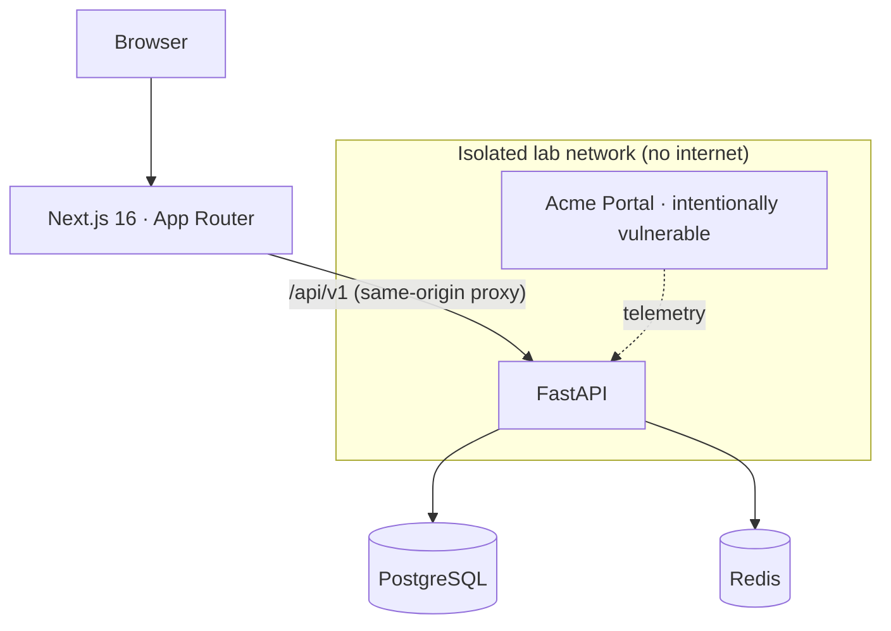

<div align="center">


# CyberForge

**The Open Cybersecurity Lab.**

Simulate attacks. Understand telemetry. Write detections. Investigate incidents.

<sub>Created and maintained by <a href="https://rahmankutlu.com">Abdurrahman Kutlu</a> · <a href="mailto:info@rahmankutlu.com">info@rahmankutlu.com</a></sub>

[](https://github.com/rahmankutlu/cyberforge/actions/workflows/ci.yml)
[](https://github.com/rahmankutlu/cyberforge/actions/workflows/codeql.yml)
[](LICENSE)
[](https://github.com/rahmankutlu/cyberforge/releases)

</div>

---

CyberForge is an open-source, local-first cybersecurity lab for **blue teams, SOC analysts and detection engineers**. It joins four things that are usually taught apart: a **cyber range**, a **mini SOC**, **detection engineering** with Sigma, YARA and Suricata, and **MITRE ATT&CK** mapping, and adds an **AI security** section for agents and LLM applications. Everything is synthetic, everything runs on your machine, and nothing needs an account.

```text
Attack  →  Telemetry  →  Detection  →  Alert  →  Investigation
```

Every simulated attack is followed all the way through: what it leaves in the logs, the rule that catches it, the alert an analyst sees, and how the incident is worked and contained.

<div align="center">



<sub>Demo mode at <code>/demo</code>: about 80 seconds, deterministic, no external service and no AI provider. <a href="docs/demo-mode.md">How it works</a>.</sub>

</div>

## Why CyberForge

- **You can see why a rule matched.** The [detection playground](docs/detections.md#the-playground) traces every selection, field and value, and the condition path, for any event. It is the fastest way to learn how a Sigma rule really behaves.
- **Detections are tested like code.** Every Sigma rule ships with events that must match and events that must not, run by `pnpm test:detections` and gated in CI. Coverage and quality checks are calculated from the repository, never typed in.
- **Incidents are stories, not isolated labs.** [Attack stories](docs/stories.md) walk an analyst through a whole intrusion: reveal the evidence, mark findings, answer questions, choose containment, read what really happened.
- **It is easy to contribute to.** `pnpm create:lab` scaffolds a lab that already validates. A new detection is two small YAML files. CI tells you what is wrong.
- **It is safe by construction.** Simulations replay telemetry; they send no packets. Targets are limited to localhost, private ranges and `*.lab.internal`. See [Safety boundaries](#safety-boundaries).

## What's inside

<!-- prettier-ignore-start -->
<!-- stats:start -->
<!-- Generated by `pnpm content:readme`. Do not edit by hand. -->

| | |
| --- | ---: |
| Labs | 20 |
| Sigma rules | 56 |
| YARA rules | 5 |
| Suricata rules | 5 |
| MITRE techniques mapped | 53 |
| Attack stories | 5 |
| Detection datasets | 11 |
| Live demos | 1 |
| Detection tests | 204 |
| Detection test coverage | 56/56 (100%) |

<!-- stats:end -->
<!-- prettier-ignore-end -->

These numbers are generated from the repository (`python -m cyberforge content stats`), and CI fails if they go stale.

|                               |                                                                                                                                                                                 |
| ----------------------------- | ------------------------------------------------------------------------------------------------------------------------------------------------------------------------------- |
| **Detection playground**      | Pick a dataset, edit a Sigma, YARA or Suricata rule, run it, and see the match trace, the false-positive hints, the SIEM translations and the ATT&CK mapping.                   |
| **Rule tests**                | `<rule>.tests.yml` beside every rule: positive, negative, multi-event and correlation cases. One command, non-zero exit on failure, a CI summary with coverage.                 |
| **Attack stories**            | Five complete, synthetic incidents with a live pipeline strip (telemetry → detections → alerts → MITRE → decisions → containment → lessons) and an investigation graph.         |
| **Demo mode**                 | A deterministic 80-second incident with severity escalation, a MITRE heatmap and a generated summary. Built for a 15-second recording.                                          |
| **Cyber range**               | 20 safe labs across web, API, Linux, Windows, network, cloud and AI security, each with objectives, a simulation, expected detections, MITRE mapping, questions and mitigation. |
| **Mini SOC**                  | Alert queue, analyst notes, assignment, investigations with timelines, incident reports as Markdown or JSON, and a live event stream on the dashboard.                          |
| **MITRE ATT&CK explorer**     | Coverage by labs, detections, stories and tests, filterable by platform (Windows, Linux, Network, Web, Cloud, AI security), from official ATT&CK v19 and ATLAS data.            |
| **AI security**               | Prompt injection, indirect injection, RAG poisoning, tool abuse and MCP misconfiguration, taught with synthetic agents and a trust-boundary model.                              |
| **Community lab SDK**         | `pnpm create:lab`, a strict lab manifest with a JSON Schema, lab-local rules and tests, and an isolated docker-compose option.                                                  |
| **AI SOC analyst (optional)** | Advisory analysis of an alert through OpenAI-compatible APIs, Gemini or Ollama. The model has no tools and nothing it suggests is executed.                                     |
| **Learning**                  | Six tracks and _30 Days of CyberForge_. Progress stays in your browser: no account.                                                                                             |

## Quick start

```bash
git clone https://github.com/rahmankutlu/cyberforge.git
cd cyberforge
cp .env.example .env
docker compose up --build
```

|                        |                            |
| ---------------------- | -------------------------- |
| **Web app**            | http://localhost:3000      |
| **Live demo**          | http://localhost:3000/demo |
| **API**                | http://localhost:8000      |
| **API docs (OpenAPI)** | http://localhost:8000/docs |

The database is seeded automatically with synthetic labs, telemetry, alerts, incidents and threat intelligence, so the platform is useful the moment it starts. No account, API key or internet connection is required.

Prefer no Docker? See [Getting started](docs/getting-started.md): the API runs on SQLite with `pnpm dev:api` and the web app with `pnpm dev:web`.

Want the vulnerable lab containers too? `docker compose --profile labs up --build`. They run on an isolated network with no internet access and are reachable only on `127.0.0.1`.

## Detection playground

Left: the rule. Centre: the events. Right: the answer to _why_.

<picture>
  <source media="(prefers-color-scheme: light)" srcset="docs/assets/screenshots/detection-playground-light.png">
  
</picture>

For each event the trace names the matching selector, field and value, shows the condition path (`selection_image AND selection_flag AND NOT filter_management`) and the result, lists the false positives the rule documents, and shows which exclusions applied. Eleven curated datasets (Windows process execution, authentication failures, DNS anomalies, HTTP access logs, Linux auth logs, cloud audit logs, PowerShell simulation, web shell telemetry, admin account creation, lateral movement, and YARA file samples) each list the rules they are expected to trigger, and CI proves it.

## Rule tests and quality

```yaml
# detections/sigma/windows/win-encoded-powershell-command.tests.yml
tests:
  - name: detects encoded PowerShell
    event:
      Image: 'C:\Windows\System32\WindowsPowerShell\v1.0\powershell.exe'
      CommandLine: "powershell.exe -nop -w hidden -enc VwByAGkAdABlAC0ATwB1AHQAcAB1AHQA "
    expected: true

  - name: ignores encoded PowerShell started by the endpoint-management agent
    event:
      Image: 'C:\Windows\System32\WindowsPowerShell\v1.0\powershell.exe'
      CommandLine: "powershell.exe -enc VwByAGkAdABlAC0ATwB1AHQAcAB1AHQA "
      ParentImage: 'C:\Windows\CCM\CcmExec.exe'
    expected: false
```

```text
$ pnpm test:detections
✓ win-encoded-powershell-command
  ✓ detects encoded PowerShell
  ✓ ignores encoded PowerShell started by the endpoint-management agent
  ...
56 rules
204 tests
0 failures
Detection test coverage: 56/56 rules (100%)
```

A pull request that adds or changes a rule fails if the rule or its tests are invalid, a positive test does not match, a negative test matches, a MITRE identifier does not exist, or the rule has no tests. Each rule also gets seven deterministic quality checks (schema valid, MITRE mapped, description, false-positive notes, positive tests, negative tests, translation verified), shown on its page. See [Testing detections](docs/testing-detections.md).

## Attack stories

<picture>
  <source media="(prefers-color-scheme: light)" srcset="docs/assets/screenshots/story-mode-light.png">
  
</picture>

Compromised developer workstation · Suspicious admin account activity · Web application intrusion · Credential abuse and lateral movement · AI agent tool abuse. Every detection a story lists is a shipped rule, and CI checks that it fires on that step's telemetry. See [Stories](docs/stories.md).

## MITRE ATT&CK coverage

<picture>
  <source media="(prefers-color-scheme: light)" srcset="docs/assets/screenshots/mitre-coverage-light.png">
  
</picture>

Technique and tactic data is generated from MITRE's official STIX and ATLAS releases by [`scripts/build_mitre_data.py`](scripts/build_mitre_data.py), which **fails if any identifier in the curated list does not exist upstream**, so CyberForge cannot ship an invented technique ID. The explorer shows what covers each technique (labs, detections, stories, tests, alerts) and which techniques are covered but lack a tested rule. See [MITRE](docs/mitre.md).

## Dashboard

<picture>
  <source media="(prefers-color-scheme: light)" srcset="docs/assets/screenshots/dashboard-light.png">
  
</picture>

## The labs

|   # | Lab                                                                                                       | Focus      | Detections that fire                                              |
| --: | --------------------------------------------------------------------------------------------------------- | ---------- | ----------------------------------------------------------------- |
|  01 | [Broken Authentication](labs/web/broken-authentication)                                                   | Web        | Failed-login burst                                                |
|  02 | [SQL Injection Fundamentals](labs/web/sql-injection-fundamentals)                                         | Web        | SQLi probes, scanner user agent                                   |
|  03 | [Cross-Site Scripting](labs/web/cross-site-scripting)                                                     | Web        | XSS payloads                                                      |
|  04 | [IDOR / Broken Access Control](labs/web/idor-broken-access-control)                                       | Web        | Object-ID enumeration                                             |
|  05 | [JWT Misconfiguration](labs/api/jwt-misconfiguration)                                                     | API        | `alg: none` tokens                                                |
|  06 | [Secrets Exposure](labs/web/secrets-exposure)                                                             | Web        | Sensitive-file probes, secrets in URLs                            |
|  07 | [API Rate Limit Misconfiguration](labs/api/api-rate-limit-misconfiguration)                               | API        | Request flood                                                     |
|  08 | [Docker Security Misconfiguration](labs/linux/docker-security-misconfiguration)                           | Containers | Privileged start, Docker socket                                   |
|  09 | [Linux Authentication Investigation](labs/linux/linux-authentication-investigation)                       | Linux      | 7 rules across the intrusion chain                                |
|  10 | [Suspicious PowerShell Detection Simulation](labs/windows-sim/suspicious-powershell-detection-simulation) | Windows    | 6 rules: parent-child, encoded, cradle, script block, persistence |
|  11 | [Network Reconnaissance Detection](labs/network/network-reconnaissance-detection)                         | Network    | Port scan (distinct ports)                                        |
|  12 | [DNS Anomaly Investigation](labs/network/dns-anomaly-investigation)                                       | Network    | DGA, NXDOMAIN burst, DNS tunnelling                               |
|  13 | [Web Shell Telemetry Analysis](labs/windows-sim/web-shell-telemetry-analysis)                             | Windows    | File drop, command request, shell spawn                           |
|  14 | [Brute Force Detection](labs/windows-sim/brute-force-detection)                                           | Windows    | Guessing, spraying, RDP, backdoor admin, log clear                |
|  15 | [Cloud Audit Log Investigation](labs/cloud/cloud-audit-log-investigation)                                 | Cloud      | 6 rules: root login to public bucket                              |
|  16 | [Prompt Injection](labs/ai-security/prompt-injection)                                                     | AI         | Override attempt, system-prompt canary                            |
|  17 | [Indirect Prompt Injection](labs/ai-security/indirect-prompt-injection)                                   | AI         | Injected retrieval, blocked exfiltration                          |
|  18 | [RAG Poisoning Concepts](labs/ai-security/rag-poisoning-concepts)                                         | AI         | Poisoned ingestion and retrieval                                  |
|  19 | [Tool Abuse in AI Agents](labs/ai-security/tool-abuse-in-ai-agents)                                       | AI         | Sensitive path, off-list tool, egress                             |
|  20 | [MCP Security Misconfiguration](labs/ai-security/mcp-security-misconfiguration)                           | AI         | Unauthenticated tool server                                       |

Every lab is a directory of plain files, `lab.yaml` plus `README.md`, `telemetry/`, and optionally its own `detections/` and `tests/`. Each lab's simulated telemetry is **tested to trigger exactly the detections it declares**. See [Labs](docs/labs.md) and [Creating a lab](docs/creating-a-lab.md).

## Detection engineering

Rules live in [`detections/`](detections) as ordinary Sigma, YARA and Suricata files. CyberForge evaluates the Sigma rules with its own engine on top of pySigma's parsed rule tree (typed values, modifiers, `1 of selection_*`, `not`, and the correlation types `event_count`, `value_count`, `temporal` and `temporal_ordered`), so a lab does not just _describe_ a detection: it runs one. YARA and Suricata rules are validated and previewed with small teaching evaluators (text and regex strings, `content` and `pcre` on HTTP and DNS), and the limits are stated, not hidden.

```yaml
title: Burst Of Failed Logons From One Source
correlation:
  type: event_count
  rules: [failed_logon]
  group-by: [IpAddress]
  timespan: 5m
  condition: { gte: 10 }
level: high
tags: [attack.t1110.001]
```

Translations to Elastic (Lucene), Splunk SPL, Microsoft Sentinel KQL, OpenSearch and a generic SQL-like form come from [pySigma](https://github.com/SigmaHQ/pySigma). Processing pipelines map the fields to ECS, Splunk or ASIM names ([details](docs/detections.md#translation-pipelines)). Every shipped rule documents its false positives.

## AI security

The [AI security](docs/ai-security.md) section models an agent as `User → LLM → Agent → Tool → Sensitive resource`, with retrieved content feeding the model, and marks each arrow as a trust boundary: how it fails, which control belongs there, and which detection watches it. Five labs and one attack story use synthetic agents and sandboxed tools; the model is a deterministic local stand-in. **Nothing in CyberForge attacks an external AI service.**

The optional **Analyze with AI** button sends one alert to a provider you configure. It is designed defensively: the model is offered **no tools**, alert data is quoted to it as untrusted evidence, its output is validated against a fixed schema and rendered as plain text, it is clearly labelled AI-generated, and **nothing it suggests is ever executed**. The platform, including demo mode, works fully without it.

## Architecture



Content (labs, rules and their tests, datasets, stories, demos, MITRE data, learning tracks) lives in the repository as validated files. Labs, rules and MITRE data are synced into PostgreSQL on start-up; stories, demos and playground datasets are served straight from the files. The API replays scenario telemetry, runs the Sigma engine and creates aggregated alerts; the web app renders everything with Server Components and URL-driven filters. Read [Architecture](docs/architecture.md) for the full picture.

## Languages

The interface and all authored content (labs, stories, learning tracks, detections, the AI security model) are available in **English** and **Turkish**. Switch in the top bar or in Settings; first-time visitors get their browser's language. Turkish content is human-reviewed against a terminology glossary and checked in CI, never machine-translated at build time. See [Localization](docs/localization.md).

## Safety boundaries

CyberForge is built for **local labs, owned environments and education**. It contains no exploitation of real systems, credential theft, persistence, malware, evasion tooling or internet-scale scanning, and it is deliberately hard to point at anything else:

- **Simulations replay telemetry.** They send no packets. Optional simulation targets must be `localhost`, a private address or `*.lab.internal`; URLs, ports, credentials and external addresses are rejected, and names are never resolved.
- **Vulnerable services are isolated.** The one intentionally vulnerable container runs read-only, non-root, with all capabilities dropped, on a Docker network marked `internal` (no internet), reachable only through a gateway bound to `127.0.0.1`.
- **Everything is synthetic, and CI checks it.** Stories, demos and datasets may only use RFC 1918 and RFC 5737 addresses and reserved host names.
- **No account, no cloud.** No telemetry, indicators or usage data leave your machine, unless you opt in to AI analysis with a provider you chose.

Details, threat model and hardening notes: [Security model](docs/security-model.md). To report a vulnerability, see [SECURITY.md](SECURITY.md).

## Repository layout

```text
cyberforge/
├── apps/
│   ├── web/            Next.js 16 app (TypeScript strict, Tailwind v4)
│   └── api/            FastAPI service (Python 3.12, SQLAlchemy 2, Alembic) and the `cyberforge` CLI
├── packages/
│   ├── ui/             Design-system primitives (shadcn/ui-style on Radix)
│   ├── types/          TypeScript types for the API
│   ├── config/         Shared tsconfig / ESLint configuration
│   └── security-content/  Learning tracks, 30-day plan, threat intel, AI trust model
├── labs/               20 labs + the vulnerable lab app
├── detections/         sigma/ (each rule with its .tests.yml)  yara/  suricata/
├── stories/            Attack stories
├── demos/              Demo mode scenarios
├── datasets/           Synthetic telemetry: background data and playground/ datasets
├── mitre/              ATT&CK and ATLAS data (generated from the official releases)
├── schemas/            JSON Schema for lab, story, dataset, demo and test files
├── examples/           A custom detection, a custom lab, and ten synthetic incidents
├── docs/  docker/  scripts/  .github/
```

## Development

Runtime baseline: **Node 22** and **Python 3.12**.

```bash
pnpm install
python -m venv apps/api/.venv && apps/api/.venv/bin/pip install -e "apps/api[dev]"   # Scripts\pip on Windows

pnpm dev:api             # http://localhost:8000  (SQLite, auto-seeded)
pnpm dev:web             # http://localhost:3000

pnpm test                # Vitest + Pytest
pnpm test:detections     # every Sigma rule's positive and negative tests
pnpm test:e2e            # Playwright (builds the web app, starts a fresh API)
pnpm lint && pnpm typecheck && pnpm typecheck:api
pnpm validate:content    # labs, stories, datasets, MITRE IDs, scenarios, links
pnpm i18n:check          # every English content string has a reviewed Turkish translation
pnpm create:lab web my-lab      # scaffold a lab that already validates
pnpm screenshots         # regenerate the README visuals (see docs/demo-assets.md)
```

The `cyberforge` command line (`python -m cyberforge --help`) covers `detections test`, `detections quality`, `content stats`, `story validate`, `lab create`, `lab validate` and `validate`.

The REST API, content schemas, CLI and configuration are a stable contract from 1.0 ([Versioning](docs/versioning.md)); CI runs lint, type checks, Pytest and Vitest with coverage floors, the API contract check, the detection tests, Playwright, content and translation validation, PostgreSQL migrations, a Docker smoke test, CodeQL and dependency review; see [CONTRIBUTING.md](CONTRIBUTING.md).

## Roadmap

See [ROADMAP.md](ROADMAP.md) for what is next, and the [contributor backlog](docs/contributor-backlog.md) for ideas that are ready to pick up.

## Contributing

Labs, rules, datasets, stories, translations and fixes are very welcome, and adding content is designed to be easy. Add a detection in [two small files](docs/creating-a-detection.md), or a lab with `pnpm create:lab`; CI tells you what is wrong. Start with [CONTRIBUTING.md](CONTRIBUTING.md), pick something from the [contributor backlog](docs/contributor-backlog.md), and please follow the [Code of Conduct](CODE_OF_CONDUCT.md).

## Author

CyberForge is created and maintained by **Abdurrahman Kutlu**: [rahmankutlu.com](https://rahmankutlu.com) · [info@rahmankutlu.com](mailto:info@rahmankutlu.com) · [@rahmankutlu](https://github.com/rahmankutlu). For help, see [SUPPORT.md](SUPPORT.md); to cite it in teaching or research, use the **Cite this repository** button (`CITATION.cff`).

## License

Software and documentation are released under the [MIT License](LICENSE). Educational content (labs, lessons and detection rules) is provided under the same license so it can be reused freely. MITRE ATT&CK® and ATLAS™ data is © The MITRE Corporation and used under its terms; see [NOTICE.md](NOTICE.md) for this and other third-party attributions.
