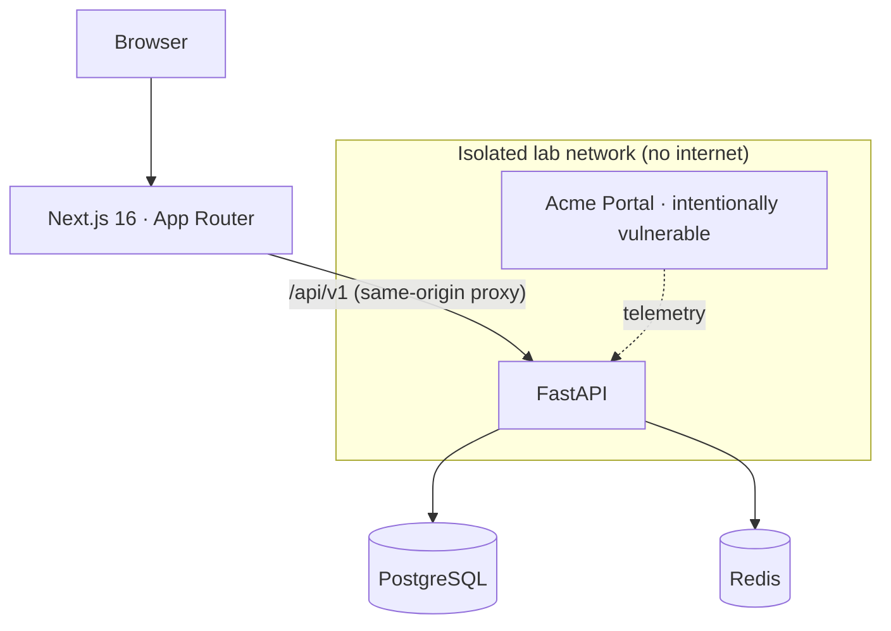

<div align="center">


# CyberForge

**An open, local-first cybersecurity lab for detection engineering.**

Simulate attacks. Understand telemetry. Write and test detections. Investigate incidents.

[](https://github.com/rahmankutlu/cyberforge/actions/workflows/ci.yml)
[](https://github.com/rahmankutlu/cyberforge/actions/workflows/e2e.yml)
[](https://github.com/rahmankutlu/cyberforge/actions/workflows/codeql.yml)
[](https://github.com/rahmankutlu/cyberforge/actions/workflows/security.yml)
[](https://github.com/rahmankutlu/cyberforge/releases)
[](LICENSE)

[Quick start](#quick-start) · [Features](#features) · [Documentation](#documentation) · [Contributing](#contributing) · [Changelog](CHANGELOG.md)

</div>

---

CyberForge is for **blue teams, SOC analysts and detection engineers** who want to learn by doing. It joins four things that are usually taught apart: a cyber range, a mini SOC, detection engineering with Sigma, YARA and Suricata, and MITRE ATT&CK mapping. It adds a section on AI security for agents and LLM applications. Everything is synthetic, everything runs on your machine, and nothing needs an account.

```text
Attack  →  Telemetry  →  Detection  →  Alert  →  Investigation
```

Every simulated attack is followed all the way through: what it leaves in the logs, the rule that catches it, the alert an analyst sees, and how the incident is worked and contained.

<div align="center">


<sub>Demo mode at <code>/demo</code>: about 80 seconds, deterministic, no external service. <a href="docs/demo-mode.md">How it works</a>.</sub>

</div>

## Why CyberForge

|                                  |                                                                                                                                                                                              |
| -------------------------------- | -------------------------------------------------------------------------------------------------------------------------------------------------------------------------------------------- |
| **See why a rule matched**       | The [playground](docs/detections.md#the-playground) traces every selection, field and value, and the condition path, for any event. It is the fastest way to learn how a Sigma rule behaves. |
| **Detections are tested**        | Every Sigma rule ships with events that must match and events that must not. CI runs them, and coverage and quality are calculated from the repository, never typed in.                      |
| **Incidents, not isolated labs** | [Attack stories](docs/stories.md) walk an analyst through a whole intrusion: reveal evidence, mark findings, answer questions, choose containment, read what really happened.                |
| **Safe by construction**         | Simulations replay telemetry and send no packets. Targets are limited to localhost, private ranges and `*.lab.internal`. See [Safety boundaries](#safety-boundaries).                        |
| **Easy to contribute to**        | A detection is two small YAML files. `pnpm create:lab` scaffolds a lab that already validates. CI tells you what is wrong.                                                                   |

## Quick start

```bash
git clone https://github.com/rahmankutlu/cyberforge.git
cd cyberforge
cp .env.example .env
docker compose up --build
```

| Service                | URL                        |
| ---------------------- | -------------------------- |
| **Web app**            | http://localhost:3000      |
| **Live demo**          | http://localhost:3000/demo |
| **API**                | http://localhost:8000      |
| **API docs (OpenAPI)** | http://localhost:8000/docs |

The database is seeded with synthetic labs, telemetry, alerts and incidents, so the platform is useful the moment it starts. No account, API key or internet connection is required.

Without Docker, the API runs on SQLite (`pnpm dev:api`) and the web app with `pnpm dev:web`; see [Getting started](docs/getting-started.md). The vulnerable lab containers are opt-in: `docker compose --profile labs up --build`. They run on an isolated network with no internet access and are reachable only on `127.0.0.1`.

## Features

<picture>
  <source media="(prefers-color-scheme: light)" srcset="docs/assets/screenshots/detection-playground-light.png">
  
</picture>

|                           |                                                                                                                                                                                                  |
| ------------------------- | ------------------------------------------------------------------------------------------------------------------------------------------------------------------------------------------------ |
| **Detection playground**  | Pick a dataset, edit a Sigma, YARA or Suricata rule, run it, and read the match trace, false-positive hints, SIEM translations and ATT&CK mapping.                                               |
| **Rule tests**            | `<rule>.tests.yml` beside every rule: positive, negative, multi-event and correlation cases. One command, a non-zero exit on failure, a CI summary with coverage.                                |
| **SIEM translation**      | Sigma to Elastic, Splunk, Microsoft Sentinel and OpenSearch through pySigma, with [processing pipelines](docs/detections.md#translation-pipelines) that map fields to ECS, Splunk or ASIM names. |
| **Attack stories**        | Five synthetic incidents with a live pipeline strip (telemetry, detections, alerts, MITRE, decisions, containment, lessons) and an investigation graph.                                          |
| **Cyber range**           | Labs across web, API, Linux, Windows, network, cloud and AI security. Each has objectives, a simulation, expected detections, MITRE mapping, questions and mitigation.                           |
| **Mini SOC**              | Alert queue, analyst notes, assignment, investigations with timelines, incident reports as Markdown or JSON, and a live event stream.                                                            |
| **MITRE ATT&CK explorer** | Coverage by labs, detections, stories and tests, filterable by platform, built from the official ATT&CK and ATLAS releases.                                                                      |
| **AI security**           | Prompt injection, indirect injection, RAG poisoning, tool abuse and MCP misconfiguration, taught with synthetic agents and a trust-boundary model.                                               |
| **Learning**              | Six tracks and a 30-day plan. Progress stays in your browser.                                                                                                                                    |
| **English and Turkish**   | The interface and all authored content, human-reviewed and checked in CI. See [Localization](docs/localization.md).                                                                              |

### What is in the repository

<!-- prettier-ignore-start -->
<!-- stats:start -->
<!-- Generated by `pnpm content:readme`. Do not edit by hand. -->

| | |
| --- | ---: |
| Labs | 20 |
| Sigma rules | 56 |
| YARA rules | 5 |
| Suricata rules | 5 |
| MITRE techniques mapped | 53 |
| Attack stories | 5 |
| Detection datasets | 11 |
| Live demos | 1 |
| Detection tests | 204 |
| Detection test coverage | 56/56 (100%) |

<!-- stats:end -->
<!-- prettier-ignore-end -->

These numbers come from `python -m cyberforge content stats`, and CI fails if they go stale.

## Detections as code

A rule and its tests live side by side:

```yaml
# detections/sigma/windows/win-encoded-powershell-command.tests.yml
tests:
  - name: detects encoded PowerShell
    event:
      Image: 'C:\Windows\System32\WindowsPowerShell\v1.0\powershell.exe'
      CommandLine: "powershell.exe -nop -w hidden -enc VwByAGkAdABlAC0ATwB1AHQAcAB1AHQA "
    expected: true

  - name: ignores encoded PowerShell started by the endpoint-management agent
    event:
      Image: 'C:\Windows\System32\WindowsPowerShell\v1.0\powershell.exe'
      CommandLine: "powershell.exe -enc VwByAGkAdABlAC0ATwB1AHQAcAB1AHQA "
      ParentImage: 'C:\Windows\CCM\CcmExec.exe'
    expected: false
```

```text
$ pnpm test:detections
✓ win-encoded-powershell-command
  ✓ detects encoded PowerShell
  ✓ ignores encoded PowerShell started by the endpoint-management agent
  ...
56 rules · 204 tests · 0 failures
Detection test coverage: 56/56 rules (100%)
```

A pull request fails if a rule or its tests are invalid, a positive test does not match, a negative test matches, a MITRE identifier does not exist, or a rule has no tests. Each rule also gets seven deterministic quality checks, shown on its page. See [Testing detections](docs/testing-detections.md).

CyberForge evaluates Sigma on its own engine, built on pySigma's parsed rule tree. It supports typed values, modifiers, `1 of selection_*`, `not` and the correlation types `event_count`, `value_count`, `temporal` and `temporal_ordered`, so a lab does not just describe a detection: it runs one. YARA and Suricata use small teaching evaluators, and their limits are stated in [Detections](docs/detections.md), not hidden.

## The labs

Labs are plain directories: `lab.yaml`, a `README.md`, `telemetry/`, and optionally their own `detections/` and `tests/`. Each lab's simulated telemetry is tested to trigger exactly the detections it declares.

| Area                     | Examples                                                                                                                                                                                                                                        |
| ------------------------ | ----------------------------------------------------------------------------------------------------------------------------------------------------------------------------------------------------------------------------------------------- |
| **Web**                  | [Broken authentication](labs/web/broken-authentication), [SQL injection](labs/web/sql-injection-fundamentals), [XSS](labs/web/cross-site-scripting), [IDOR](labs/web/idor-broken-access-control)                                                |
| **API**                  | [JWT misconfiguration](labs/api/jwt-misconfiguration), [rate limit misconfiguration](labs/api/api-rate-limit-misconfiguration)                                                                                                                  |
| **Linux and containers** | [Docker misconfiguration](labs/linux/docker-security-misconfiguration), [Linux authentication investigation](labs/linux/linux-authentication-investigation)                                                                                     |
| **Windows**              | [Suspicious PowerShell](labs/windows-sim/suspicious-powershell-detection-simulation), [web shell telemetry](labs/windows-sim/web-shell-telemetry-analysis), [brute force](labs/windows-sim/brute-force-detection)                               |
| **Network**              | [Reconnaissance](labs/network/network-reconnaissance-detection), [DNS anomalies](labs/network/dns-anomaly-investigation)                                                                                                                        |
| **Cloud**                | [Cloud audit log investigation](labs/cloud/cloud-audit-log-investigation)                                                                                                                                                                       |
| **AI security**          | [Prompt injection](labs/ai-security/prompt-injection), [RAG poisoning](labs/ai-security/rag-poisoning-concepts), [tool abuse](labs/ai-security/tool-abuse-in-ai-agents), [MCP misconfiguration](labs/ai-security/mcp-security-misconfiguration) |

The full catalogue is in [Labs](docs/labs.md). To add one, see [Creating a lab](docs/creating-a-lab.md).

## AI security

The [AI security](docs/ai-security.md) section models an agent as `User → LLM → Agent → Tool → Sensitive resource`, with retrieved content feeding the model, and marks each arrow as a trust boundary: how it fails, which control belongs there and which detection watches it. The labs use synthetic agents and sandboxed tools, and the model is a deterministic local stand-in. **Nothing in CyberForge attacks an external AI service.**

The optional **Analyze with AI** button sends one alert to a provider you configure (OpenAI-compatible APIs, Gemini or Ollama). The model is offered no tools, alert data is quoted to it as untrusted evidence, its output is validated against a fixed schema and shown as plain text, and nothing it suggests is ever executed. The platform, including demo mode, works fully without it.

## Architecture



Content (labs, rules and their tests, datasets, stories, demos, MITRE data, learning tracks) is validated files in the repository. Labs, rules and MITRE data are synced into PostgreSQL on start-up; stories, demos and playground datasets are served straight from the files. The API replays scenario telemetry, runs the Sigma engine and creates aggregated alerts, and the web app renders everything with Server Components and URL-driven filters. See [Architecture](docs/architecture.md).

| Layer     | Technology                                                                              |
| --------- | --------------------------------------------------------------------------------------- |
| Web       | Next.js 16 (App Router), React 19, TypeScript (strict), Tailwind CSS v4, TanStack Query |
| API       | FastAPI, Pydantic, SQLAlchemy 2, Alembic, Python 3.12                                   |
| Detection | pySigma, a custom Sigma evaluator, YARA and Suricata teaching evaluators                |
| Data      | PostgreSQL and Redis with Docker Compose, SQLite for local development                  |
| Tooling   | pnpm workspaces, Vitest, Pytest, Playwright with axe, Ruff, mypy                        |

## Engineering

- **A stable contract.** The REST API, content schemas, CLI and configuration are a public contract from 1.0 under [Semantic Versioning](docs/versioning.md). The OpenAPI document is committed, and CI fails when the code and the contract disagree.
- **Quality gates in CI.** Lint, strict type checks, Pytest and Vitest with coverage floors, the detection tests, content and translation validation, PostgreSQL migrations, a Docker smoke test and Playwright end-to-end tests with accessibility checks must pass before a change merges.
- **Security checks.** CodeQL, dependency review and a weekly audit of locked dependencies. Release images are published to GHCR with an SBOM and build provenance.
- **One version everywhere.** `pnpm versions:check` fails when the packages, the API, `CITATION.cff`, the changelog or a release tag disagree.
- **Generated facts.** The counts in this README and the JSON Schemas are produced from the repository and checked in CI.

## Safety boundaries

CyberForge is built for local labs, owned environments and education. It contains no exploitation of real systems, credential theft, persistence, malware, evasion tooling or internet-scale scanning, and it is deliberately hard to point at anything else:

- **Simulations replay telemetry.** They send no packets. Optional simulation targets must be `localhost`, a private address or `*.lab.internal`; URLs, ports, credentials and external addresses are rejected, and names are never resolved.
- **Vulnerable services are isolated.** The one intentionally vulnerable container runs read-only, non-root, with all capabilities dropped, on a Docker network marked `internal`, reachable only through a gateway bound to `127.0.0.1`.
- **Everything is synthetic, and CI checks it.** Stories, demos and datasets may only use RFC 1918 and RFC 5737 addresses and reserved host names.
- **No account, no cloud.** No telemetry or usage data leaves your machine unless you opt in to AI analysis with a provider you chose.

Details and the threat model: [Security model](docs/security-model.md). To report a vulnerability, see [SECURITY.md](SECURITY.md).

## Documentation

| Topic                   | Read                                                                                                                                                  |
| ----------------------- | ----------------------------------------------------------------------------------------------------------------------------------------------------- |
| Install and first steps | [Getting started](docs/getting-started.md)                                                                                                            |
| Detection engineering   | [Detections](docs/detections.md) · [Testing detections](docs/testing-detections.md) · [Creating a detection](docs/creating-a-detection.md)            |
| Labs, stories and demo  | [Labs](docs/labs.md) · [Creating a lab](docs/creating-a-lab.md) · [Stories](docs/stories.md) · [Demo mode](docs/demo-mode.md)                         |
| MITRE and AI security   | [MITRE](docs/mitre.md) · [AI security](docs/ai-security.md)                                                                                           |
| Design and contract     | [Architecture](docs/architecture.md) · [Security model](docs/security-model.md) · [Versioning](docs/versioning.md) · [OpenAPI](docs/api/openapi.json) |
| Localization            | [Localization](docs/localization.md)                                                                                                                  |
| Project                 | [Changelog](CHANGELOG.md) · [Roadmap](ROADMAP.md) · [Contributor backlog](docs/contributor-backlog.md)                                                |

## Development

Runtime baseline: **Node 22**, **pnpm 10** and **Python 3.12**.

```bash
pnpm install
python -m venv apps/api/.venv && apps/api/.venv/bin/pip install -e "apps/api[dev]"   # Scripts\pip on Windows

pnpm dev:api             # http://localhost:8000  (SQLite, auto-seeded)
pnpm dev:web             # http://localhost:3000

pnpm test                # Vitest + Pytest
pnpm test:detections     # every Sigma rule's positive and negative tests
pnpm test:e2e            # Playwright (builds the web app, starts a fresh API)
pnpm lint && pnpm typecheck && pnpm typecheck:api
pnpm validate:content    # labs, stories, datasets, MITRE IDs, scenarios, links
pnpm i18n:check          # every English content string has a reviewed Turkish translation
pnpm create:lab web my-lab      # scaffold a lab that already validates
```

The `cyberforge` command line (`python -m cyberforge --help`) covers `detections test`, `detections quality`, `content stats`, `story validate`, `lab create`, `lab validate` and `validate`.

<details>
<summary>Repository layout</summary>

```text
cyberforge/
├── apps/
│   ├── web/            Next.js app (TypeScript strict, Tailwind v4)
│   └── api/            FastAPI service, Alembic migrations and the `cyberforge` CLI
├── packages/
│   ├── ui/             Design-system primitives
│   ├── types/          TypeScript types for the API
│   ├── config/         Shared tsconfig and ESLint configuration
│   └── security-content/  Learning tracks, 30-day plan, threat intel, AI trust model
├── labs/               Labs and the vulnerable lab app
├── detections/         sigma/ (each rule with its .tests.yml), yara/, suricata/
├── stories/            Attack stories
├── demos/              Demo mode scenarios
├── datasets/           Synthetic telemetry and playground datasets
├── mitre/              ATT&CK and ATLAS data, generated from the official releases
├── schemas/            JSON Schema for lab, story, dataset, demo and test files
├── examples/           A custom detection, a custom lab and synthetic incidents
└── docs/  docker/  scripts/  .github/
```

</details>

## Contributing

Labs, rules, datasets, stories, translations and fixes are welcome. Start with [CONTRIBUTING.md](CONTRIBUTING.md), pick something from the [contributor backlog](docs/contributor-backlog.md), and please follow the [Code of Conduct](CODE_OF_CONDUCT.md). For help, see [SUPPORT.md](SUPPORT.md).

## Author

CyberForge is created and maintained by **Abdurrahman Kutlu**: [rahmankutlu.com](https://rahmankutlu.com) · [info@rahmankutlu.com](mailto:info@rahmankutlu.com) · [@rahmankutlu](https://github.com/rahmankutlu). To cite it in teaching or research, use the **Cite this repository** button (`CITATION.cff`).

## License

Software and documentation are released under the [MIT License](LICENSE). Educational content (labs, lessons and detection rules) is provided under the same license so it can be reused freely. MITRE ATT&CK® and ATLAS™ data is © The MITRE Corporation and used under its terms; see [NOTICE.md](NOTICE.md) for this and other third-party attributions.
