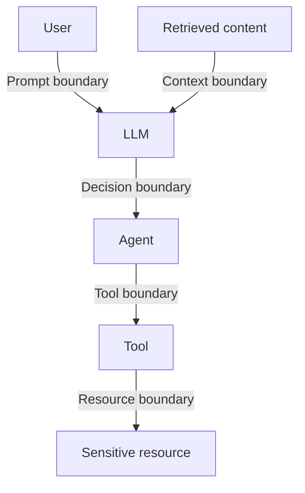

# AI security

Large-language-model applications and agents fail in ways conventional applications do not. This section teaches those failure modes with **synthetic agents and sandboxed tools**, and adds an optional, defensive **AI SOC analyst**.

> **Boundary:** CyberForge does not attack external AI services, does not ship jailbreak tooling, and does not exfiltrate anything. Every AI lab replays telemetry from a synthetic agent; the "model" in those scenarios is a deterministic local stand-in and every destination uses a reserved `.example` domain.

## The trust-boundary model

The central fact: **the model cannot reliably separate instructions from data.** Anything that reaches the context can act as an instruction. So each boundary needs a control that does not depend on the model behaving.

| Boundary                    | How it fails                                                                                                                               | Control that belongs here                                                                                    | Detections                                                                                  |
| --------------------------- | ------------------------------------------------------------------------------------------------------------------------------------------ | ------------------------------------------------------------------------------------------------------------ | ------------------------------------------------------------------------------------------- |
| **Prompt** (user → LLM)     | Direct prompt injection overrides intended behaviour; system prompt leakage exposes hidden instructions and any secrets inside.            | Assume the system prompt is public; canary tokens; output filtering.                                         | `ai-prompt-instruction-override-attempt`, `ai-system-prompt-canary-in-response`             |
| **Context** (content → LLM) | Indirect prompt injection hides instructions in content the agent processes; RAG poisoning plants documents that steer everyone's answers. | Provenance and trust tiers; quarantine model-directed instructions; citations.                               | `ai-retrieved-content-contains-instructions`, `ai-rag-ingest-untrusted-instruction-content` |
| **Decision** (LLM → agent)  | Excessive autonomy; model output executed without validation.                                                                              | Structured, validated output; human approval for destructive or external actions.                            | _(enforced by design)_                                                                      |
| **Tool** (agent → tool)     | Tools outside the task are reachable; MCP servers are unauthenticated or bound too widely.                                                 | Per-agent allow-lists in code; authenticated, privately-bound servers; treat tool descriptions as untrusted. | `ai-agent-tool-not-on-allowlist`, `ai-mcp-server-without-authentication`                    |
| **Resource** (tool → data)  | File tools read credentials; outbound tools send data to attacker-controlled hosts.                                                        | Path and destination allow-lists; least-privilege credentials; log every call with the policy decision.      | `ai-agent-tool-call-sensitive-path`, `ai-agent-outbound-transfer-to-unlisted-host`          |

The model lives in [`packages/security-content/ai-security/trust-boundaries.yaml`](../packages/security-content/ai-security/trust-boundaries.yaml) and drives the interactive chain at `/ai-security`.

## Topics and labs

| Topic                         | OWASP LLM Top 10 (2025) | MITRE ATLAS          | Lab    |
| ----------------------------- | ----------------------- | -------------------- | ------ |
| Prompt injection              | LLM01                   | AML.T0051.000        | 16     |
| Indirect prompt injection     | LLM01                   | AML.T0051.001        | 17     |
| System prompt leakage         | LLM07                   | AML.T0056            | 16     |
| RAG poisoning                 | LLM08                   | AML.T0070            | 18     |
| Tool abuse / excessive agency | LLM06                   | AML.T0053            | 19     |
| MCP security                  | LLM06                   | AML.T0053, AML.T0084 | 20     |
| Data leakage                  | LLM02                   | AML.T0057, AML.T0086 | 16, 17 |

`/ai-security/findings` lists every alert raised on AI-gateway telemetry, grouped by the boundary that failed, with the control that belongs there.

## Telemetry

AI labs use the `ai_gateway` category: one JSON record per `user_prompt`, `retrieval`, `ingest`, `tool_call` (with the policy `decision` and `guardrail_flags`), `model_response` and `mcp_registration`. Rules match on fields such as `event_type`, `retrieved_content`, `tool_name`, `tool_args` and `guardrail_flags`. Log the **policy decision**, not just the call: blocked attempts are your evidence that something tried to misuse the agent.

## The AI SOC analyst (optional)

**Analyze with AI** on an alert page asks a configured model to explain one alert: summary, severity explanation, likely technique, why the rule fired, evidence to review, investigation steps, false positives and containment suggestions.

### Guarantees (enforced in code and tested)

| Guarantee                   | How                                                                                                                                                                                                      |
| --------------------------- | -------------------------------------------------------------------------------------------------------------------------------------------------------------------------------------------------------- |
| **Optional.**               | With no provider configured the button explains why and nothing else changes.                                                                                                                            |
| **Opt-in per alert.**       | Nothing is sent to a provider until you click _Analyze_.                                                                                                                                                 |
| **Cannot act.**             | The provider adapters send text only. No `tools`, `functions` or `tool_choice` are ever declared, so a response cannot trigger anything. The tests assert this on the outgoing request.                  |
| **Never runs commands.**    | There is no code path from model output to a shell, an API mutation or a file. Containment suggestions are text for a human.                                                                             |
| **Defensive only.**         | The system prompt forbids exploit code and evasion advice.                                                                                                                                               |
| **Treats logs as hostile.** | Alert data is passed inside `<telemetry>` tags with an explicit instruction never to follow directions found inside it, because log content can be attacker-controlled (that is what the AI labs teach). |
| **Structured output.**      | The reply is parsed as JSON against a fixed schema; anything else is rejected as "unavailable".                                                                                                          |
| **Rendered as text.**       | React escapes every field; nothing is interpreted as HTML or Markdown.                                                                                                                                   |
| **Clearly labelled.**       | Every analysis carries an _AI-generated analysis_ badge, the provider and model, and a disclaimer. Stored analyses are shown as previous analyses.                                                       |

### Providers

| `CYBERFORGE_AI_PROVIDER` | Endpoint                                     | Notes                                                                                                   |
| ------------------------ | -------------------------------------------- | ------------------------------------------------------------------------------------------------------- |
| `openai`                 | `POST {base}/chat/completions`               | Any OpenAI-compatible server (hosted, vLLM, LM Studio, gateways). Key optional when you set a base URL. |
| `gemini`                 | `POST {base}/models/{model}:generateContent` | Key sent in the `x-goog-api-key` header.                                                                |
| `ollama`                 | `POST {base}/api/chat`                       | Local models; nothing leaves your machine.                                                              |

Set `CYBERFORGE_AI_MODEL` (required), and `CYBERFORGE_AI_API_KEY` / `CYBERFORGE_AI_BASE_URL` as needed. **A hosted provider receives the alert's telemetry when you click Analyze.** Use Ollama, or synthetic demo data only, if that matters to you.

## Further reading

- [OWASP Top 10 for LLM Applications](https://genai.owasp.org/llm-top-10/)
- [MITRE ATLAS](https://atlas.mitre.org/)
- [Model Context Protocol authorization](https://modelcontextprotocol.io/specification/latest/basic/authorization)
