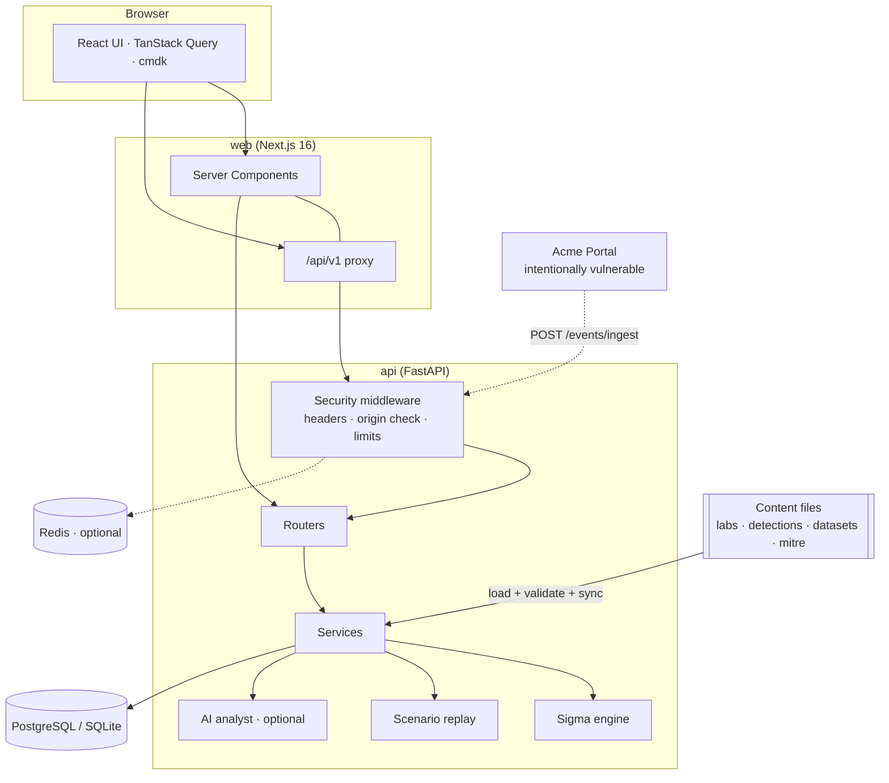
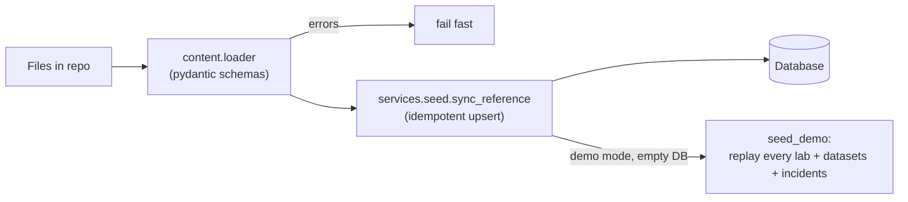
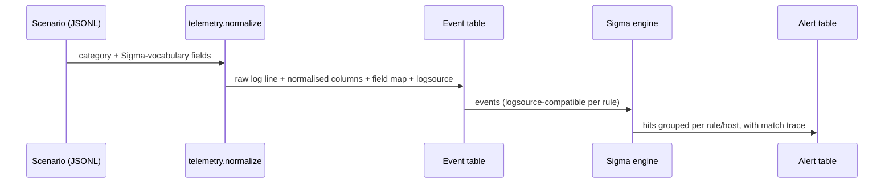
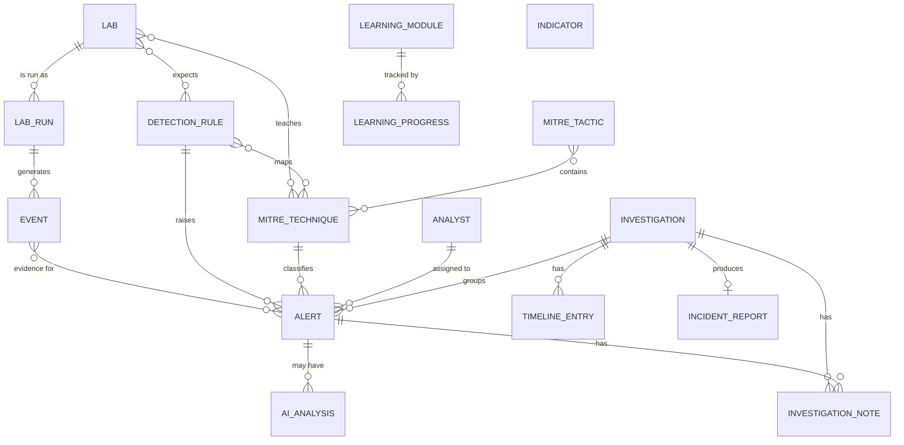

# Architecture

This document explains how CyberForge is put together and why. For a shorter overview, see [ARCHITECTURE.md](../ARCHITECTURE.md).

## Guiding decisions

| Decision                                                                                                                                                          | Why                                                                                                                                            |
| ----------------------------------------------------------------------------------------------------------------------------------------------------------------- | ---------------------------------------------------------------------------------------------------------------------------------------------- |
| **Content is files, validated in CI.** Labs, rules, datasets, MITRE data and learning tracks live in the repository and are synced into the database at start-up. | Contributors add content with a normal pull request. Nothing depends on a hidden database state, and `pnpm validate:content` protects quality. |
| **Simulations replay telemetry; they do not attack.**                                                                                                             | Safe by construction, deterministic and testable. Live activity comes only from the isolated lab containers.                                   |
| **The detection engine is real.** Alerts come from evaluating Sigma rules, not from a hard-coded table.                                                           | The lifecycle view can show the raw log, the matched values and the rule, because they are genuinely connected.                                |
| **One engine for replay and live data.**                                                                                                                          | A replayed scenario and an event shipped by a lab container go through the same code.                                                          |
| **Server Components + URL state.** Filters, sorting and pagination live in the query string.                                                                      | Instant loads, shareable links, no client-side data-fetching library for lists. TanStack Query is used for mutations and search.               |
| **Same-origin API.** The browser only talks to the web app, which proxies `/api/v1`.                                                                              | No CORS surface, and the API can stay off the public network.                                                                                  |
| **Optional everything else.** Redis, AI and the lab containers are optional.                                                                                      | The default install is small and works offline.                                                                                                |

## System overview

## Content pipeline

- **`cyberforge/content/schemas.py`** is the single source of truth for content shape: `LabDoc`, `ScenarioEvent`, learning, incidents, indicators. `pnpm validate:content` and the API both use it.
- **`content/loader.py`** loads everything and cross-validates references: every MITRE identifier exists, every rule a lab declares exists, learning modules reference real labs, and so on. The API refuses to start on any error.
- **`services/seed.py`** upserts reference data on every start (safe to repeat, preserves user-created rules) and seeds demo activity once, when the database has no alerts.

Since v0.2 some content is served straight from files instead of the database, because it needs no persistence and reads better as a reviewable diff:

| Content             | Where                                  | How it is used                                                                                  |
| ------------------- | -------------------------------------- | ----------------------------------------------------------------------------------------------- |
| Rule tests          | `detections/sigma/**/<slug>.tests.yml` | Run by `services/rule_tests.py`; results, coverage and quality are computed once per process.   |
| Attack stories      | `stories/*.yaml`                       | `services/stories.py` runs the shipped rules over a story's telemetry to build its view.        |
| Playground datasets | `datasets/playground/*.yaml`           | `services/playground.py` materialises events or files and evaluates a rule with an explanation. |
| Demo scenarios      | `demos/*.yaml`                         | `services/demo.py` derives alerts, severity, MITRE, process chain and summary from telemetry.   |
| Lab-local rules     | `labs/<domain>/<lab>/detections/`      | Loaded with the shared rules and synced to the database like them.                              |

Progress in stories and the demo lives in the browser only. There is no server-side "run" entity.

`cyberforge.cli` (`python -m cyberforge`) is the small command line over these modules: `detections test`, `detections quality`, `content stats`, `story validate`, `lab create`, `lab validate` and `validate`. `scripts/export_schemas.py` writes JSON Schema for the file types to `schemas/`.

## Telemetry and detection

**Categories** (`services/telemetry.py`) define, for each kind of log, the Sigma _logsource_, how to render a realistic raw line (Sysmon JSON, syslog, auditd, BIND, iptables-style, Apache access, CloudTrail JSON, AI-gateway JSON), and how to extract normalised columns. Scenario files use the same field names Sigma rules use (`Image`, `CommandLine`, `c-ip`, `eventName`, …).

**The engine** (`services/sigma_engine.py`) parses rules with pySigma and evaluates its resolved condition tree, so modifiers, wildcards, CIDR, regular expressions, comparisons, `fieldref`, `exists`, `1 of`/`all of` and `not` behave exactly as pySigma defines them. It adds Sigma **correlation** support: `event_count`, `value_count`, `temporal` and `temporal_ordered`, with sliding windows and group-by. It returns a _trace_ of which field matched which pattern, which is what the lifecycle view highlights.

**Alerting** (`services/detection_engine.py`) aggregates hits into one alert per rule and host (and correlation group), so a 26-event DNS burst is one alert with 26 evidence events. Alerts carry severity from the rule level, confidence, the primary technique (the first ATT&CK tag the rule author listed), and a deduplication key.

**Translation** (`services/sigma_service.py`) uses pySigma backends for Elastic (Lucene), Splunk, Sentinel (Kusto), and OpenSearch, and a small generic SQL-like renderer built from the same condition tree. Field names are passed through unchanged; the response says so, because a production deployment needs the right pySigma processing pipeline.

## Data model

Schema changes ship as Alembic migrations (`cyberforge/migrations`), run automatically at start-up. Portable column types (JSON, timezone-aware datetimes through a `UTCDateTime` decorator) let the same models run on PostgreSQL and SQLite.

## API

`/api/v1` is versioned and documented at `/docs`. Routers are grouped by domain: `labs`, `events`, `alerts`, `investigations`, `detections` (including `/detections/quality` and `/detections/{slug}/tests`), `playground`, `stories`, `showcase` (demo scripts and the SSE event stream), `mitre`, `intel`, `learning`, `ai`, `meta` (dashboard, search, docs, seeded demo data, settings). Conventions: pagination through `page`/`page_size` and a `Page` envelope, explicit sort whitelists, LIKE-escaped search, Pydantic request and response models, `422` for validation, `404` for missing resources.

Cross-cutting concerns live in `security.py` middleware: security headers, the Origin/CSRF check, a body-size limit and rate limiting (Redis when reachable, memory otherwise). Health (`/health`) and readiness (`/ready`) are unauthenticated.

## Web app

- **Routing & data:** Next.js App Router. Pages are Server Components that call the API directly and render tables from `searchParams`. Sort headers and pagination are plain links.
- **Interactivity:** small Client Components for the things that need state: the lifecycle view, notes, the Sigma workbench, the trust-boundary chain, the command palette, and toggles. Mutations use TanStack Query and then `router.refresh()`.
- **Design system:** `packages/ui` holds shadcn/ui-style primitives on Radix and Tailwind v4 tokens (dark first, light equal). Charts (Recharts) are code-split.
- **Local state:** learning progress, remembered filters and the "acting analyst" live in `localStorage`, always behind safe guards, so the app works without storage.
- **Performance:** no client-side list fetching, lazy charts, pagination everywhere, `force-dynamic` only where data is live.

## Extension points

| To add…               | Do this                                                                                                                                                                                                             |
| --------------------- | ------------------------------------------------------------------------------------------------------------------------------------------------------------------------------------------------------------------- |
| A lab                 | Add `labs/<domain>/<slug>/` with `lab.yaml` and `telemetry/scenario.jsonl`; run `pnpm content:labs` and `pnpm validate:content`.                                                                                    |
| A Sigma rule          | Add a `.yml` and its `.tests.yml` under `detections/sigma/`; `python scripts/assign_rule_ids.py` for the id; `pnpm test:detections`. See [Creating a detection](creating-a-detection.md).                           |
| A story or a dataset  | Add `stories/<slug>.yaml` or `datasets/playground/<slug>.yaml`; `pnpm validate:content` proves the rules it lists really fire. See [Stories](stories.md).                                                           |
| A demo scenario       | Add `demos/<slug>.yaml`; alerts, severity, MITRE and the summary are derived. See [Demo mode](demo-mode.md).                                                                                                        |
| A telemetry category  | Add a `CategorySpec` in `services/telemetry.py` (logsource, renderer, summary).                                                                                                                                     |
| A translation target  | Add a pySigma backend to `sigma_service._pysigma_targets()` and `TARGET_IDS`.                                                                                                                                       |
| An AI provider        | Subclass `AIProvider` in `ai/providers.py` and register it in `provider_status`.                                                                                                                                    |
| **PDF report export** | The report model is complete (`services/reports.py`); render `report_dict` with your PDF engine of choice behind a new `format=pdf` on the export endpoint. The UI shows a disabled _PDF (extension point)_ button. |
| Authentication        | Put an identity-aware proxy in front, or add a FastAPI dependency; analysts are a table already.                                                                                                                    |

## Testing strategy

| Layer        | Tool       | What it proves                                                                                                                                                       |
| ------------ | ---------- | -------------------------------------------------------------------------------------------------------------------------------------------------------------------- |
| Content      | Pytest     | Every shipped file validates; every lab triggers exactly its declared rules; near-miss datasets stay quiet.                                                          |
| Detections   | Pytest     | Every Sigma rule's positive and negative tests pass; the match trace never disagrees with the engine; datasets, stories and demos fire the rules they declare.       |
| Engine       | Pytest     | Sigma semantics: modifiers, conditions, correlation windows, translation.                                                                                            |
| API          | Pytest     | Every endpoint and workflow, guardrails, hardening headers, the AI analyst's constraints, the vulnerable lab app and its telemetry path.                             |
| UI logic     | Vitest     | Formatting, URL state, highlighting, progress, the lifecycle component, tables and filters.                                                                          |
| Whole system | Playwright | Dashboard → labs → simulation → alert → lifecycle → MITRE → Sigma validate/translate/test → investigation → notes → report export → AI fallback, on a fresh backend. |

## Known limitations of 1.x

See [ROADMAP.md](../ROADMAP.md). In short: no user accounts, a single-node design, the vulnerable lab is one web app, Sigma field mapping pipelines are not applied automatically, and API response types are hand-maintained in `packages/types` (drift is caught by the end-to-end tests; generating them from OpenAPI is planned).
