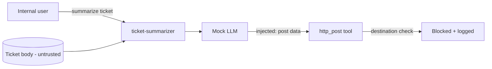

<!-- Generated from lab.yaml by `pnpm content:labs`. Edit lab.yaml, not this file. -->

# Lab 17 - Indirect Prompt Injection

**Intermediate** · 45 min · LLM Application Security · `ai-security` · MITRE: `AML.T0051.001`, `AML.T0086`

Follow an injection that arrives inside content an agent was asked to process, and see how outbound allow-lists stop the data leaving even when the model is fooled.

## Objectives
- Explain why content retrieved by an agent is an untrusted input channel.
- Trace an indirect injection from retrieval to attempted tool use.
- Explain why the user sees nothing wrong and why logging is the only visibility.
- Design controls at the tool boundary that work even when the model is compromised.

## Scenario
An internal user asks for a summary of a support ticket. The ticket, written by an outsider, contains hidden instructions telling the assistant to post customer data to an external address. The model tries to comply; the gateway blocks it. The user receives a normal-looking summary.

## Architecture
A synthetic ticket-summarizing agent reads ticket bodies written by outsiders. It has an HTTP post tool guarded by a destination allow-list. The model is a deterministic local mock and every URL uses a reserved example domain, so nothing can leave the lab.

| Component | Role | Network |
| --- | --- | --- |
| ticket-summarizer | Synthetic agent with a read tool and an outbound tool | `lab-internal` |
| Destination allow-list | Policy layer in the gateway | `lab-internal` |
| CyberForge API | Runs detections on gateway events | `backend` |

## Lab setup

1. Open this lab in CyberForge and select Run simulation.
2. Open the AI Security overview to see where the trust boundary fails in this chain.

## Telemetry

- **AI gateway log** (`cyberforge/ai_gateway`): Prompts, retrievals, tool calls with policy decision, and responses.

The simulated events live in [`telemetry/scenario.jsonl`](telemetry/scenario.jsonl).

## Attack simulation

The simulation replays a legitimate request, a retrieval containing hidden instructions, a blocked outbound tool call, and an innocuous final answer. There is no real external destination.

1. **Legitimate request** - The internal user's prompt is entirely benign.
2. **Poisoned retrieval** - The ticket body carries text addressed to the assistant.
3. **Attempted exfiltration** - The model calls http_post with a destination outside the allow-list; policy blocks it.

## Expected detection

The retrieval rule flags instruction-like text in retrieved content; the outbound rule flags the blocked, non-allow-listed destination. The second is critical because it shows intent to exfiltrate.

- `ai-retrieved-content-contains-instructions`
- `ai-agent-outbound-transfer-to-unlisted-host`

## Investigation questions

1. Where did the malicious instruction enter the system?
   

Hint and answer

   *Hint:* The user prompt was benign; look at retrievals.

   *Answer:* Through the retrieved body of ticket 4821, an untrusted, outsider-authored source.

   

2. What stopped the data leaving, and is that control sufficient on its own?
   

Hint and answer

   *Hint:* Read the tool call decision.

   *Answer:* The destination allow-list blocked the call. It is necessary but not sufficient; also limit what data the agent can read and require approval for sensitive actions.

   

## Mitigation
- Treat all retrieved content as untrusted; separate instructions from data and mark provenance.
- Enforce egress allow-lists and per-tool permissions in code outside the model.
- Give agents the minimum data access needed for the task and require human approval for sensitive actions.
- Log every retrieval and tool call with the policy decision and alert on blocked attempts.

## Cleanup
- Nothing to clean up: this lab runs entirely from telemetry.

## References

- [OWASP LLM01 Prompt Injection](https://genai.owasp.org/llmrisk/llm01-prompt-injection/)
- [MITRE ATLAS AML.T0051.001 Indirect](https://atlas.mitre.org/techniques/AML.T0051.001)

## Safety

Scope: `simulation-only` · Network: `none`. This lab only ever targets isolated CyberForge lab systems or synthetic data. See the [security model](../../../docs/security-model.md).
