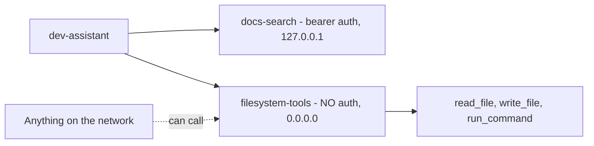

<!-- Generated from lab.yaml by `pnpm content:labs`. Edit lab.yaml, not this file. -->

# Lab 20 - MCP Security Misconfiguration

**Advanced** · 45 min · LLM Application Security · `ai-security` · MITRE: `AML.T0053`, `AML.T0084`

Review how Model Context Protocol servers get registered, and detect an unauthenticated, wide-binding tool server that hands filesystem and command tools to any caller.

## Objectives
- Explain what an MCP server exposes and why authentication and binding matter.
- Compare a well-configured docs server with a dangerous filesystem server.
- Detect insecure registrations and blocked tool attempts from gateway telemetry.
- Write a checklist for approving new MCP servers.

## Scenario
A developer connects an assistant to two tool servers. The second one was started for a quick test, bound to every interface with no authentication, and exposes a command tool. The agent later reads a credentials file through it and attempts to run a command.

## Architecture
A synthetic developer assistant registers two tool servers. One is read-only, authenticated and bound to localhost; the other is bound to all interfaces with no authentication and exposes file and command tools. Only registration and call telemetry exists; no server process is started.

| Component | Role | Network |
| --- | --- | --- |
| dev-assistant | Synthetic agent that registers MCP servers | `lab-internal` |
| docs-search | Read-only server with bearer authentication | `lab-internal` |
| filesystem-tools | Unauthenticated server with powerful tools (intentional flaw) | `lab-internal` |
| CyberForge API | Runs registration and call detections | `backend` |

## Lab setup

1. Open this lab in CyberForge and select Run simulation.
2. Read the registration events first, then the calls that used the risky server.

## Telemetry

- **AI gateway log** (`cyberforge/ai_gateway`): Server registrations (transport, bind address, auth) and tool calls with decisions.

The simulated events live in [`telemetry/scenario.jsonl`](telemetry/scenario.jsonl).

## Attack simulation

The simulation replays two server registrations and two tool calls through the risky server. No server is started and no real file is read; the arguments are illustrative.

1. **Good registration** - A docs server with bearer authentication on localhost.
2. **Risky registration** - A filesystem server bound to all interfaces without authentication exposing read, write and command tools.
3. **Use** - The agent reads a credentials path and attempts a command through the server.

## Expected detection

Three rules fire: the unauthenticated registration, the sensitive-path file read, and the tool outside the allow-list. The registration alert is the earliest chance to prevent the rest.

- `ai-mcp-server-without-authentication`
- `ai-agent-tool-call-sensitive-path`
- `ai-agent-tool-not-on-allowlist`

## Investigation questions

1. Which registration setting turned a local convenience into a network exposure?
   

Hint and answer

   *Hint:* Compare the bind addresses.

   *Answer:* Binding to 0.0.0.0:9200 with mcp_auth none, rather than 127.0.0.1 with bearer authentication.

   

2. Does the policy block on run_command make the server safe?
   

Hint and answer

   *Hint:* What can other clients do?

   *Answer:* No. The policy protects only this agent; the server still exposes run_command to anything that reaches the port.

   

## Mitigation
- Require authentication on every MCP server and bind to localhost or a private interface only.
- Expose the minimum tools per server; never publish command execution to an agent that does not need it.
- Review and pin server definitions and tool descriptions; treat them as untrusted input.
- Keep an inventory of registered servers and alert on new or changed registrations.

## Cleanup
- Nothing to clean up: this lab runs entirely from telemetry.

## References

- [MCP authorization specification](https://modelcontextprotocol.io/specification/latest/basic/authorization)
- [MITRE ATLAS AML.T0053 AI Agent Tool Invocation](https://atlas.mitre.org/techniques/AML.T0053)

## Safety

Scope: `simulation-only` · Network: `none`. This lab only ever targets isolated CyberForge lab systems or synthetic data. See the [security model](../../../docs/security-model.md).
