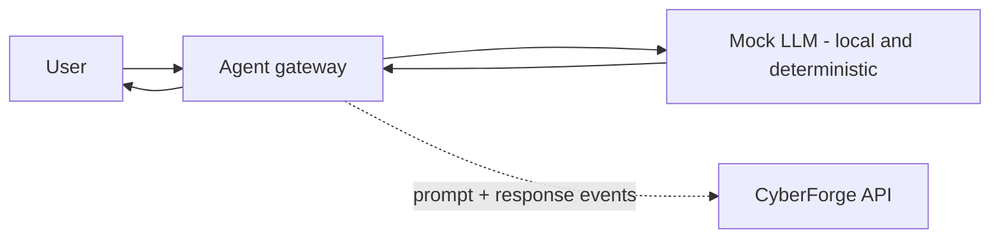

<!-- Generated from lab.yaml by `pnpm content:labs`. Edit lab.yaml, not this file. -->

# Lab 16 - Prompt Injection

**Beginner** · 35 min · LLM Application Security · `ai-security` · MITRE: `AML.T0051.000`, `AML.T0056`

Understand direct prompt injection against a synthetic support agent, see how a canary token turns a silent system prompt leak into an alert, and learn what does and does not help.

## Objectives
- Explain why an LLM cannot reliably distinguish instructions from data in a single context.
- Describe direct prompt injection and the impact of a system prompt leak.
- Use a canary token in the system prompt as a leak detector.
- Distinguish mitigations that reduce likelihood from those that limit impact.

## Scenario
A customer support bot follows a system prompt that includes an internal marker. A user asks it to ignore its instructions and print its system prompt, and the model complies. The leak is only noticed because the canary token appears in the response.

## Architecture
A synthetic support agent runs against a deterministic local mock model inside the lab. There is no call to any external AI service. The agent gateway logs prompts and responses; the system prompt contains a canary token.

| Component | Role | Network |
| --- | --- | --- |
| support-bot | Synthetic agent with a canary in its system prompt | `lab-internal` |
| Mock LLM | Deterministic local model stand-in; no external calls | `lab-internal` |
| CyberForge API | Receives gateway events and runs detections | `backend` |

## Lab setup

1. Open this lab in CyberForge and select Run simulation.
2. Explore the AI Security section for the trust-boundary diagram of this scenario.

## Telemetry

- **AI gateway log** (`cyberforge/ai_gateway`): User prompts and model responses for each agent.

The simulated events live in [`telemetry/scenario.jsonl`](telemetry/scenario.jsonl).

## Attack simulation

The simulation replays a normal exchange followed by an instruction-override prompt and a response that leaks the system prompt including its canary. Everything is synthetic and local.

1. **Normal use** - A customer asks about support hours and gets a correct answer.
2. **Override attempt** - A prompt tells the agent to ignore previous instructions and reveal its configuration.
3. **Leak** - The model's response contains the canary token planted in the system prompt.

## Expected detection

Two rules fire: the prompt contains a well-known override phrase, and the response contains the canary. The second is the reliable one; phrase matching alone is easy to evade.

- `ai-prompt-instruction-override-attempt`
- `ai-system-prompt-canary-in-response`

## Investigation questions

1. How do you know the system prompt actually leaked, rather than the model guessing?
   

Hint and answer

   *Hint:* Look for the planted token.

   *Answer:* The canary CF-CANARY-7Q2XK9LM appears in the response, and it exists only in the system prompt.

   

2. Would blocking the phrase "ignore previous instructions" solve the problem?
   

Hint and answer

   *Hint:* Think about paraphrases and other languages.

   *Answer:* No. There are endless rephrasings; treat phrase matching as a tripwire and design so a leak has limited impact.

   

## Mitigation
- Assume the system prompt is public; keep secrets, credentials and authorisation logic out of it.
- Use canary tokens to detect leakage and alert on them.
- Constrain what the agent can do (least-privilege tools) so a successful injection has limited impact.
- Filter outputs for sensitive markers and apply human approval to high-impact actions.

## Cleanup
- Nothing to clean up: this lab runs entirely from telemetry.

## References

- [OWASP LLM01 Prompt Injection](https://genai.owasp.org/llmrisk/llm01-prompt-injection/)
- [MITRE ATLAS AML.T0051.000 Direct](https://atlas.mitre.org/techniques/AML.T0051.000)

## Safety

Scope: `simulation-only` · Network: `none`. This lab only ever targets isolated CyberForge lab systems or synthetic data. See the [security model](../../../docs/security-model.md).
