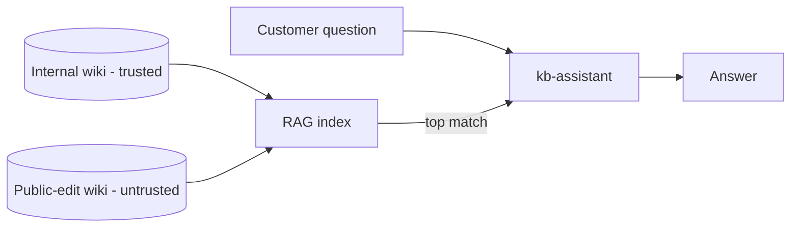

<!-- Generated from lab.yaml by `pnpm content:labs`. Edit lab.yaml, not this file. -->

# Lab 18 - RAG Poisoning Concepts

**Intermediate** · 40 min · LLM Application Security · `ai-security` · MITRE: `AML.T0070`, `AML.T0051.001`

Learn how untrusted content that enters a retrieval index can steer answers for unrelated users, and where to put controls in the ingestion and retrieval pipeline.

## Objectives
- Describe the retrieval-augmented generation pipeline and its trust boundaries.
- Explain how poisoning an index affects users who never interacted with the attacker.
- Identify ingestion-time and retrieval-time detection points.
- Propose provenance, trust tiers and filtering for indexed content.

## Scenario
A page on a publicly editable wiki is indexed alongside trusted content. It contains a false claim about refunds and text addressed to the assistant. An hour later a different customer asks a normal refund question, the poisoned page is the top match, and the assistant repeats the false claim.

## Architecture
A synthetic knowledge-base assistant retrieves from an index fed by a trusted internal wiki and a publicly editable one. The pipeline is simulated as telemetry; no embedding model or vector database is involved, so the lab focuses on the trust decisions rather than the technology.

| Component | Role | Network |
| --- | --- | --- |
| RAG indexer | Ingests documents from trusted and untrusted sources | `lab-internal` |
| kb-assistant | Synthetic assistant that answers from retrieved text | `lab-internal` |
| CyberForge API | Runs ingestion and retrieval detections | `backend` |

## Lab setup

1. Open this lab in CyberForge and select Run simulation.
2. Compare the ingestion alert with the retrieval alert one hour later.

## Telemetry

- **RAG pipeline log** (`cyberforge/ai_gateway`): Ingestion events with source trust and retrieval events with source and text.

The simulated events live in [`telemetry/scenario.jsonl`](telemetry/scenario.jsonl).

## Attack simulation

The simulation replays a trusted ingestion, an untrusted ingestion carrying planted instructions, an unrelated user question an hour later, the poisoned retrieval and the resulting answer.

1. **Normal ingestion** - A trusted internal policy page is indexed.
2. **Poisoned ingestion** - A public wiki page with instruction-like text is indexed.
3. **Later retrieval** - Search surfaces the poisoned page for an unrelated question.

## Expected detection

The ingestion rule flags untrusted documents that contain model-directed phrases; the retrieval rule flags the same text when it reaches the model context. The first prevents, the second contains.

- `ai-rag-ingest-untrusted-instruction-content`
- `ai-retrieved-content-contains-instructions`

## Investigation questions

1. Which control would have stopped the answer being wrong even after ingestion?
   

Hint and answer

   *Hint:* Think about provenance at retrieval time.

   *Answer:* Ranking or filtering by source trust, so untrusted pages are not used for authoritative policy answers, plus citations that let users see the source.

   

2. Why does the poisoning affect users who never touched the attacker?
   

Hint and answer

   *Hint:* Where does the shared state live?

   *Answer:* The index is shared: one bad document changes results for everyone whose question matches it.

   

## Mitigation
- Track provenance and trust tier per document; do not let untrusted sources answer policy questions.
- Scan and quarantine ingested content for model-directed instructions and require review for public sources.
- Show citations and source labels in answers so users can judge them.
- Monitor retrieval for sudden new dominant sources and re-index from trusted snapshots after incidents.

## Cleanup
- Nothing to clean up: this lab runs entirely from telemetry.

## References

- [OWASP LLM08 Vector and Embedding Weaknesses](https://genai.owasp.org/llmrisk/llm082025-vector-and-embedding-weaknesses/)
- [MITRE ATLAS AML.T0070 RAG Poisoning](https://atlas.mitre.org/techniques/AML.T0070)

## Safety

Scope: `simulation-only` · Network: `none`. This lab only ever targets isolated CyberForge lab systems or synthetic data. See the [security model](../../../docs/security-model.md).
