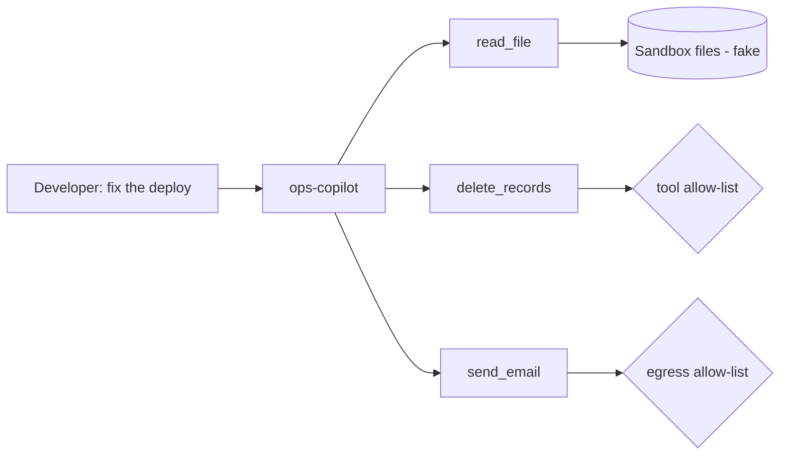

<!-- Generated from lab.yaml by `pnpm content:labs`. Edit lab.yaml, not this file. -->

# Lab 19 - Tool Abuse in AI Agents

**Advanced** · 50 min · LLM Application Security · `ai-security` · MITRE: `AML.T0053`, `AML.T0086`

Study excessive agency: an agent with broad tools acts on a vague request, reads secrets, attempts a destructive call and tries to mail data out, and see which controls actually held.

## Objectives
- Define excessive agency and connect it to over-broad tools, permissions and autonomy.
- Read agent tool-call telemetry and separate allowed from blocked decisions.
- Identify which of three defences (path policy, tool allow-list, egress allow-list) failed or succeeded.
- Redesign the agent's tool set with least privilege and approvals.

## Scenario
A developer asks an agent to fix a failed deploy. The agent reads the log, then the environment file, then attempts to delete records and to email the file's contents to an external address. Two of the four actions are blocked by policy; one is not, and that is the finding.

## Architecture
A synthetic ops copilot has file, delete and email tools running inside the lab sandbox. A policy layer in the gateway checks tool names and destinations. The sandbox exposes only fake files.

| Component | Role | Network |
| --- | --- | --- |
| ops-copilot | Synthetic agent with three tools | `lab-internal` |
| Policy layer | Tool and destination checks outside the model | `lab-internal` |
| CyberForge API | Runs detections on tool-call events | `backend` |

## Lab setup

1. Open this lab in CyberForge and select Run simulation.
2. In AI Security, open the findings view and compare which trust boundary failed at each step.

## Telemetry

- **AI gateway log** (`cyberforge/ai_gateway`): Each tool call with arguments and the policy decision.

The simulated events live in [`telemetry/scenario.jsonl`](telemetry/scenario.jsonl).

## Attack simulation

The simulation replays five gateway events. No real tool executes; the arguments illustrate what an over-privileged agent might attempt, and the decisions show which controls stopped it.

1. **Reasonable start** - Read the deploy log: allowed and appropriate.
2. **Secret read** - Read the .env file: allowed because no path policy exists.
3. **Destructive attempt** - delete_records is not on the allow-list and is blocked.
4. **Outbound attempt** - send_email to an external destination is blocked by the egress check.

## Expected detection

Three rules fire: a file read of a sensitive path, a tool outside the allow-list, and outbound transfer to an unlisted destination. The first is the unblocked failure worth fixing.

- `ai-agent-tool-call-sensitive-path`
- `ai-agent-tool-not-on-allowlist`
- `ai-agent-outbound-transfer-to-unlisted-host`

## Investigation questions

1. Which of the four actions succeeded that should not have, and why?
   

Hint and answer

   *Hint:* Look at the decision column for the .env read.

   *Answer:* Reading /srv/app/.env was allowed because the file tool has no path restriction.

   

2. What single change would have prevented the data ever reaching the email tool?
   

Hint and answer

   *Hint:* Think about least privilege.

   *Answer:* Restrict the file tool to an explicit directory allow-list that excludes secrets, so there is nothing sensitive to send.

   

## Mitigation
- Give each agent the minimum tools; restrict file tools to allow-listed directories that exclude secrets.
- Enforce tool and destination allow-lists in code outside the model.
- Require human approval for destructive or externally visible actions.
- Log arguments and decisions, and alert on blocked attempts as evidence of manipulation.

## Cleanup
- Nothing to clean up: this lab runs entirely from telemetry.

## References

- [OWASP LLM06 Excessive Agency](https://genai.owasp.org/llmrisk/llm062025-excessive-agency/)
- [MITRE ATLAS AML.T0053 AI Agent Tool Invocation](https://atlas.mitre.org/techniques/AML.T0053)

## Safety

Scope: `simulation-only` · Network: `none`. This lab only ever targets isolated CyberForge lab systems or synthetic data. See the [security model](../../../docs/security-model.md).
