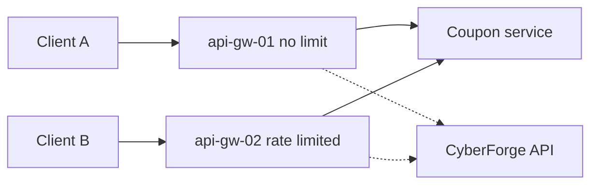

<!-- Generated from lab.yaml by `pnpm content:labs`. Edit lab.yaml, not this file. -->

# Lab 07 - API Rate Limit Misconfiguration

**Intermediate** · 35 min · Resource Consumption · `api` · MITRE: `T1499`

Compare an API gateway with and without request throttling, and detect unrestricted resource consumption from access logs.

## Objectives
- Explain how missing rate limits enable credential guessing, scraping and resource exhaustion.
- Distinguish per-client volume anomalies from normal usage in access logs.
- Recognise HTTP 429 responses as evidence that a control is working.
- Choose sensible rate-limit keys and thresholds.

## Scenario
A coupon endpoint accepts unlimited redemption attempts. A client hammers it and every request succeeds. A second client does the same against a protected gateway and is throttled. Your task is to separate the two cases in the telemetry.

## Architecture
Two lab gateway instances front the same coupon endpoint. One has no throttling; the other returns 429 after a small burst. Both report requests to CyberForge.

| Component | Role | Network |
| --- | --- | --- |
| api-gw-01 | Gateway without throttling (intentional flaw) | `lab-internal` |
| api-gw-02 | Gateway that answers 429 on bursts | `lab-internal` |
| CyberForge API | Receives telemetry, evaluates Sigma rules | `backend` |

## Lab setup

1. Open this lab in CyberForge and select Run simulation.
2. Optional: point a local load tool at the lab gateway only, never at an external address; CyberForge refuses non-lab targets.

## Telemetry

- **Gateway access log** (`web/webserver`): Requests with client address, path and status.

The simulated events live in [`telemetry/scenario.jsonl`](telemetry/scenario.jsonl).

## Attack simulation

The simulation replays a normal user, a 120-request burst that is never throttled, and a burst against the protected gateway that is answered with 429.

1. **Baseline usage** - A person redeems a handful of coupons per minute.
2. **Unthrottled burst** - One client sends 120 requests in under a minute and receives 200 every time.
3. **Throttled burst** - The same behaviour against the protected gateway is met with 429 and stops being useful.

## Expected detection

A Sigma correlation rule counts API requests per client per minute and alerts at one hundred. The throttled client never crosses the threshold, showing how prevention and detection interact.

- `web-api-request-flood`

## Investigation questions

1. How do you know the first client was not throttled?
   

Hint and answer

   *Hint:* Look at the status codes during the burst.

   *Answer:* All 120 responses were 200; the throttled client received 429s.

   

2. What would a good rate-limit key be for a login or coupon endpoint?
   

Hint and answer

   *Hint:* Consider both the address and the account.

   *Answer:* A combination of authenticated identity and source address, with a stricter limit on sensitive actions.

   

## Mitigation
- Enforce rate limits at the gateway keyed by identity and address, with stricter limits for sensitive endpoints.
- Return 429 with Retry-After and log throttling events.
- Add quotas and cost limits for expensive operations.
- Alert on sustained high volume even when throttled.

## Cleanup
- Nothing to clean up: this lab runs entirely from telemetry.

## References

- [OWASP API4 Unrestricted Resource Consumption](https://owasp.org/API-Security/editions/2023/en/0xa4-unrestricted-resource-consumption/)
- [MITRE ATT&CK T1499 Endpoint Denial of Service](https://attack.mitre.org/techniques/T1499/)

## Safety

Scope: `simulation-only` · Network: `none`. This lab only ever targets isolated CyberForge lab systems or synthetic data. See the [security model](../../../docs/security-model.md).
