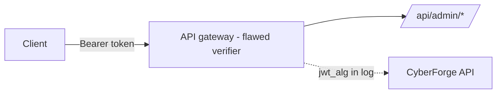

<!-- Generated from lab.yaml by `pnpm content:labs`. Edit lab.yaml, not this file. -->

# Lab 05 - JWT Misconfiguration

**Intermediate** · 45 min · Authentication · `api` · MITRE: `T1550.001`, `T1528`

Explore how a JSON Web Token verifier that trusts the token's own header can be tricked, what the request looks like in logs, and how to verify tokens safely.

## Objectives
- Describe the three parts of a JWT and which parts an attacker controls.
- Explain why accepting the "none" algorithm, or a weak shared secret, defeats signature verification.
- Detect forged-token attempts by logging the parsed algorithm header.
- List verifier settings that make token validation safe.

## Scenario
A normal user is correctly denied access to an admin endpoint. The same client then presents a token that claims admin rights and declares no signature algorithm, and the gateway serves the request. You will identify the moment the trust boundary failed.

## Architecture
The lab API gateway issues HS256 tokens and, by design, accepts unsigned tokens whose header says alg=none. It also uses a weak signing secret. The gateway logs the algorithm from each token header.

| Component | Role | Network |
| --- | --- | --- |
| Lab API gateway | Issues and verifies tokens with intentional flaws | `lab-internal` |
| lab-gateway | Localhost-only reverse proxy | `host-localhost` |
| CyberForge API | Receives telemetry, evaluates Sigma rules | `backend` |

## Lab setup

1. Start the lab: `docker compose --profile labs up -d lab-vuln-web lab-gateway`.
2. Log in via the portal, copy the token from the response, and inspect it at any offline JWT viewer or with a local base64 decode.
3. Or run the simulation in CyberForge to replay the telemetry.

## Telemetry

- **Gateway access log** (`web/webserver`): Requests with status and the token's alg header (jwt_alg).

The simulated events live in [`telemetry/scenario.jsonl`](telemetry/scenario.jsonl).

## Attack simulation

The simulation replays three normal requests, one refused admin request, and two admin requests that succeed with an alg=none token. Nothing is brute-forced; the flaw is in verification logic.

1. **Decode your token** - Base64-decode the header and payload of your own token and read the claims.
2. **Test the verifier** - In the lab, change the header algorithm and the role claim, then send the modified token to the admin endpoint.
3. **Observe the log** - Find the request where jwt_alg is none and the status flips from 403 to 200.

## Expected detection

The JWT rule alerts whenever a request presents alg=none. A correct verifier would reject such requests, so any hit in production is worth investigating.

- `web-jwt-none-algorithm`

## Investigation questions

1. Which request shows the verifier failure, and how do you know?
   

Hint and answer

   *Hint:* Compare the same path across requests.

   *Answer:* The request with jwt_alg none to /api/admin/users returned 200 where the HS256 request to the same path returned 403.

   

2. What data was accessed with the forged privileges?
   

Hint and answer

   *Hint:* Follow the same client after the first success.

   *Answer:* /api/admin/users (18 KB) and /api/admin/export (91 KB) were read.

   

## Mitigation
- Pin the accepted algorithms server-side and reject none; never trust the token header to choose.
- Use asymmetric signing (RS256/ES256) where practical and rotate keys.
- Use long random secrets for HMAC and store them in a secret manager.
- Validate issuer, audience and expiry on every token.

## Cleanup
- Stop the lab: `docker compose --profile labs down`.

## References

- [OWASP JSON Web Token Cheat Sheet](https://cheatsheetseries.owasp.org/cheatsheets/JSON_Web_Token_for_Java_Cheat_Sheet.html)
- [MITRE ATT&CK T1550.001 Application Access Token](https://attack.mitre.org/techniques/T1550/001/)

## Safety

Scope: `local-container` · Network: `lab-internal`. This lab only ever targets isolated CyberForge lab systems or synthetic data. See the [security model](../../../docs/security-model.md).
