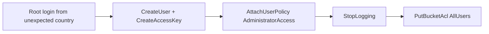

<!-- Generated from lab.yaml by `pnpm content:labs`. Edit lab.yaml, not this file. -->

# Lab 15 - Cloud Audit Log Investigation

**Intermediate** · 55 min · Cloud Security · `cloud` · MITRE: `T1078.004`, `T1136.003`, `T1098`, `T1685`, `T1530`

Investigate a cloud account takeover from audit-log events: a root login, a new administrator, disabled logging and a bucket opened to the world.

## Objectives
- Read CloudTrail-style events and identify the actor, action, source address and result.
- Recognise the privilege-escalation and defence-impairment sequence common in cloud compromises.
- Explain why root use, direct admin policy attachment and StopLogging are high-signal events.
- Use flattened event fields in Sigma rules, including a field-to-field comparison.

## Scenario
Without MFA, the root identity signs in from an unexpected country. Within four minutes a new user receives an access key and administrator rights, the audit trail is stopped, and a customer-exports bucket is opened to all users. Reconstruct the sequence and state what evidence is now missing.

## Architecture
Synthetic audit events in a CloudTrail-compatible shape (account 123456789012 is a documentation placeholder). CyberForge normalises nested fields into dotted keys and evaluates six Sigma rules.

| Component | Role | Network |
| --- | --- | --- |
| Synthetic cloud audit trail | Generated events shaped like CloudTrail records | `none` |
| CyberForge API | Normalises and evaluates events | `backend` |

## Lab setup

1. Open this lab in CyberForge and select Run simulation.
2. Walk the alerts in time order; then read the raw JSON of each in the lifecycle view.

## Telemetry

- **Cloud audit log** (`aws/cloudtrail`): API and console activity with identity, source IP and parameters.

The simulated events live in [`telemetry/scenario.jsonl`](telemetry/scenario.jsonl).

## Attack simulation

The simulation replays six audit events. It creates nothing in any cloud account: the events are generated locally and use documentation values throughout.

1. **Root login** - Console sign-in as root from an unexpected country.
2. **Create identity** - CreateUser followed by CreateAccessKey for the new user.
3. **Escalate** - AttachUserPolicy with AdministratorAccess.
4. **Blind** - StopLogging on the organisation trail.
5. **Expose** - PutBucketAcl grants AllUsers on a data bucket.

## Expected detection

Six rules fire: root login, unexpected country, key created for another user, admin policy attached, audit logging stopped and bucket made public. The access-key rule uses a field-reference comparison.

- `cloud-root-account-console-login`
- `cloud-console-login-from-unexpected-country`
- `cloud-access-key-created-for-another-user`
- `cloud-admin-policy-attached-to-user`
- `cloud-audit-logging-disabled`
- `cloud-storage-bucket-made-public`

## Investigation questions

1. Which event is the point after which you cannot see further activity in this trail, and how would you still investigate?
   

Hint and answer

   *Hint:* Find the logging change.

   *Answer:* StopLogging on org-trail; use other sources such as service-level logs, network flow logs and the provider's own event history.

   

2. What single action would best limit further damage right now?
   

Hint and answer

   *Hint:* Think about the new credential.

   *Answer:* Disable the svc-audit user and its access key, rotate root credentials and enable MFA, then re-enable logging.

   

3. Who created the access key and for whom?
   

Hint and answer

   *Hint:* Compare the caller and the target user fields.

   *Answer:* The root identity created it for svc-audit; the caller and target differ, which is why the rule fired.

   

## Mitigation
- Protect root with hardware MFA, no access keys, and alerts on any use.
- Prevent disabling logging with service control policies and send logs to a separate, write-restricted account.
- Block public bucket access at the account level and require role-based access instead of user policies.
- Alert on privileged policy attachment and on key creation for another principal.

## Cleanup
- Nothing to clean up: no cloud resources are created by this lab.

## References

- [MITRE ATT&CK T1078.004 Cloud Accounts](https://attack.mitre.org/techniques/T1078/004/)
- [AWS CloudTrail record contents](https://docs.aws.amazon.com/awscloudtrail/latest/userguide/cloudtrail-event-reference-record-contents.html)

## Safety

Scope: `simulation-only` · Network: `none`. This lab only ever targets isolated CyberForge lab systems or synthetic data. See the [security model](../../../docs/security-model.md).
