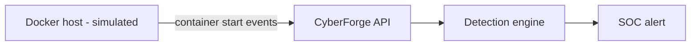

<!-- Generated from lab.yaml by `pnpm content:labs`. Edit lab.yaml, not this file. -->

# Lab 08 - Docker Security Misconfiguration

**Intermediate** · 40 min · Containers · `linux` · MITRE: `T1610`, `T1611`

Learn which container settings quietly erase isolation (privileged mode, host mounts, the Docker socket) and how to detect them from runtime telemetry.

## Objectives
- Explain what privileged mode and mounting the Docker socket give a process inside a container.
- Detect risky container starts from runtime audit events.
- Apply a hardened baseline: non-root user, dropped capabilities, read-only filesystem, no host mounts.
- Read CyberForge's own docker-compose.yml as a worked example of least privilege.

## Scenario
A platform team runs CI and debugging tooling on a shared Docker host. Over one afternoon three containers start: a hardened web server, a privileged debug image with the host root mounted, and a CI runner with the Docker socket. You decide which two are dangerous and why.

## Architecture
A simulated Docker host emits container-start events. No privileged container is ever started by CyberForge itself; the risky configurations exist only as telemetry so you can study the detection safely.

| Component | Role | Network |
| --- | --- | --- |
| Simulated Docker host | Emits container runtime audit events | `none` |
| CyberForge API | Runs detections | `backend` |

## Lab setup

1. Open this lab in CyberForge and select Run simulation.
2. Review the hardening choices in the repository's docker-compose.yml alongside the alerts.

## Telemetry

- **Container runtime audit** (`docker/runtime`): One record per container start with image, privilege flag and mounts.

The simulated events live in [`telemetry/scenario.jsonl`](telemetry/scenario.jsonl).

## Attack simulation

The simulation replays four container starts. It illustrates why the configuration is dangerous without ever running a privileged workload or exposing a real Docker socket.

1. **Hardened start** - An unprivileged web container with a read-only content mount and a numeric non-root user.
2. **Privileged plus host mount** - A debug container with privileged mode and the host root filesystem mounted.
3. **Docker socket** - A CI runner with the Docker socket mounted: it can start any container on the host.

## Expected detection

Two Sigma rules flag privileged starts and socket mounts. Each is high severity because either setting lets the container control the host.

- `container-privileged-start`
- `container-docker-socket-mounted`

## Investigation questions

1. Which containers can affect the host, and through which setting?
   

Hint and answer

   *Hint:* Compare the Privileged flag and the Mounts value for each start.

   *Answer:* debug-tools through privileged mode plus the host root mount, and ci-runner through the mounted Docker socket.

   

2. What is a safer way to give a CI job the ability to build images?
   

Hint and answer

   *Hint:* Think about rootless or daemonless builders.

   *Answer:* Use rootless builders or a remote build service so the job never gets the host daemon.

   

## Mitigation
- Never run privileged containers in shared environments; add only the specific capability required.
- Do not mount the Docker socket; use rootless or daemonless build tools.
- Run as a non-root user, drop all capabilities, and use a read-only root filesystem.
- Enforce these as policy with admission control or a runtime security tool.

## Cleanup
- Nothing to clean up: this lab runs entirely from telemetry.

## References

- [Docker security documentation](https://docs.docker.com/engine/security/)
- [OWASP Docker Security Cheat Sheet](https://cheatsheetseries.owasp.org/cheatsheets/Docker_Security_Cheat_Sheet.html)
- [MITRE ATT&CK T1611 Escape to Host](https://attack.mitre.org/techniques/T1611/)

## Safety

Scope: `simulation-only` · Network: `none`. This lab only ever targets isolated CyberForge lab systems or synthetic data. See the [security model](../../../docs/security-model.md).
