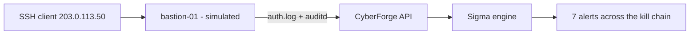

<!-- Generated from lab.yaml by `pnpm content:labs`. Edit lab.yaml, not this file. -->

# Lab 09 - Linux Authentication Investigation

**Intermediate** · 60 min · Investigation · `linux` · MITRE: `T1110.001`, `T1078`, `T1548.003`, `T1136.001`, `T1053.003`, `T1003.008`, `T1059.004`

Reconstruct an intrusion from a bastion host's auth and audit logs, from SSH guessing through privilege escalation and persistence.

## Objectives
- Read sshd, sudo and useradd entries in /var/log/auth.log and understand what each proves.
- Correlate failed and accepted logins from the same source.
- Recognise the follow-on steps after a credential compromise: escalation, new account, cron persistence, credential file reads.
- Build a timeline an incident report can be written from.

## Scenario
An internet-facing bastion accepts SSH passwords. Ten failures from one address are followed by a successful login as the deploy account. Within four minutes a root shell, a new local account, a cron entry, a shadow file read and a bash network redirect appear. Reconstruct the story in order.

## Architecture
A simulated bastion host emits syslog and auditd-style records. CyberForge normalises them, applies seven Sigma rules, and lets you pivot from alert to raw log line.

| Component | Role | Network |
| --- | --- | --- |
| bastion-01 | Simulated Linux bastion host | `none` |
| CyberForge API | Normalises logs, runs detections | `backend` |

## Lab setup

1. Open this lab in CyberForge and select Run simulation.
2. Open the resulting alerts in order of time and use the lifecycle view to read each raw log line.

## Telemetry

- **sshd and sudo (auth.log)** (`linux/auth`): Syslog authentication messages.
- **auditd** (`linux/process_creation`): Process execution and file access records.

The simulated events live in [`telemetry/scenario.jsonl`](telemetry/scenario.jsonl).

## Attack simulation

The simulation replays the full intrusion chain as telemetry. All addresses come from documentation ranges and no real connection is made anywhere.

1. **Guess** - Ten failed SSH passwords from one source against a nonexistent account.
2. **Log in** - The same source authenticates successfully as deploy.
3. **Escalate** - sudo to an interactive root shell.
4. **Persist and harvest** - A new account, a cron entry and a shadow file read follow.
5. **Call out** - A bash network redirect to a documentation-range address represents a reverse shell.

## Expected detection

Seven rules cover the chain: guessing burst, login-after-failures, sudo root shell, new local user, cron persistence, shadow read, and network redirect. Each maps to a distinct ATT&CK technique.

- `linux-ssh-brute-force-burst`
- `linux-ssh-login-after-failed-burst`
- `linux-sudo-spawns-root-shell`
- `linux-new-local-user-created`
- `linux-cron-persistence-file-modified`
- `linux-shadow-file-read`
- `linux-shell-network-redirect-pattern`

## Investigation questions

1. At what exact time did the attacker gain access, and how do you know it was the same actor as the failures?
   

Hint and answer

   *Hint:* Find the Accepted password entry and compare source addresses.

   *Answer:* The Accepted password for deploy at t+40s came from 203.0.113.50, the same address as the ten failures.

   

2. Which alert would you contain first, and what is the first action?
   

Hint and answer

   *Hint:* What gives the attacker durable access?

   *Answer:* Isolate the host and disable the deploy and svc-backup accounts; the new account and cron entry are persistence.

   

3. What evidence would confirm credential theft rather than just access?
   

Hint and answer

   *Hint:* Which alert concerns password hashes?

   *Answer:* The read of /etc/shadow by cat; treat all local password hashes as exposed.

   

## Mitigation
- Disable SSH password authentication; require keys and MFA on the bastion.
- Restrict sudo to specific commands and log full command lines.
- Manage local accounts and cron through configuration management and alert on drift.
- Monitor reads of credential files and outbound connections from shells.

## Cleanup
- Nothing to clean up: this lab runs entirely from telemetry.

## References

- [MITRE ATT&CK T1078 Valid Accounts](https://attack.mitre.org/techniques/T1078/)
- [OpenSSH manual pages](https://man.openbsd.org/sshd_config)

## Safety

Scope: `simulation-only` · Network: `none`. This lab only ever targets isolated CyberForge lab systems or synthetic data. See the [security model](../../../docs/security-model.md).
