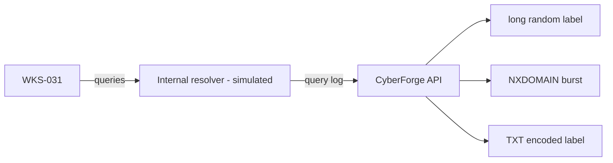

<!-- Generated from lab.yaml by `pnpm content:labs`. Edit lab.yaml, not this file. -->

# Lab 12 - DNS Anomaly Investigation

**Intermediate** · 50 min · Network Defense · `network` · MITRE: `T1568.002`, `T1071.004`, `T1572`

Investigate two DNS abuse patterns from resolver logs (domain generation and tunnelling) and learn which features separate them from normal traffic.

## Objectives
- Explain how domain generation algorithms and DNS tunnelling use the protocol differently.
- Identify NXDOMAIN bursts, long random labels and encoded TXT queries in resolver logs.
- Pick investigation pivots: client host, query volume, entropy, record type.
- Understand the false-positive risks of length and entropy heuristics.

## Scenario
A workstation begins issuing long random-looking names that all fail, then switches to TXT queries whose names look like hex data and which are answered. Decide which behaviour is generation and which is tunnelling, and how far the data has already gone.

## Architecture
A simulated workstation sends DNS queries to an internal resolver. CyberForge evaluates three Sigma rules against resolver query logs. All domains use reserved example names.

| Component | Role | Network |
| --- | --- | --- |
| WKS-031 | Simulated workstation | `none` |
| Internal resolver | Simulated DNS resolver query log | `none` |
| CyberForge API | Runs detections | `backend` |

## Lab setup

1. Open this lab in CyberForge and select Run simulation.
2. Sort the events by query and compare the two families of names.

## Telemetry

- **Resolver query log** (`network/dns`): Client, query name, record type and response code.

The simulated events live in [`telemetry/scenario.jsonl`](telemetry/scenario.jsonl).

## Attack simulation

The simulation replays normal lookups, twenty-six failed random-looking lookups, and eight hex-encoded TXT queries. The names resolve to nothing real; the domains are reserved examples.

1. **Baseline** - Repeated lookups of a known update host succeed with NOERROR.
2. **Generation** - Long random labels return NXDOMAIN at a steady rate.
3. **Tunnelling** - TXT queries with hex-looking labels return NOERROR: they are being answered.

## Expected detection

Three rules fire: long random labels, an NXDOMAIN burst, and TXT queries with encoded labels. Together they distinguish search-for-a-server from data-in-the-query.

- `dns-long-random-subdomain-query`
- `dns-nxdomain-burst`
- `dns-txt-query-with-encoded-label`

## Investigation questions

1. Which behaviour indicates the command channel was found, and which indicates it was still being searched for?
   

Hint and answer

   *Hint:* Compare response codes.

   *Answer:* NXDOMAIN failures are the search; the successful TXT answers show the channel is up.

   

2. What would you check to estimate how much data left through the tunnel?
   

Hint and answer

   *Hint:* Count queries and label lengths for the tunnel domain.

   *Answer:* Eight queries with roughly 40 encoded characters each is a small amount; confirm by summing label bytes and checking for longer-running activity.

   

## Mitigation
- Force all clients through monitored resolvers and block direct outbound DNS and DNS-over-HTTPS to unmanaged resolvers.
- Use DNS filtering or response-policy zones for newly seen and algorithmically generated domains.
- Alert on NXDOMAIN rates and on high-entropy labels, and tune with a per-network baseline.
- Restrict TXT lookups where business needs are limited.

## Cleanup
- Nothing to clean up: this lab runs entirely from telemetry.

## References

- [MITRE ATT&CK T1568.002 Domain Generation Algorithms](https://attack.mitre.org/techniques/T1568/002/)
- [MITRE ATT&CK T1071.004 DNS](https://attack.mitre.org/techniques/T1071/004/)

## Safety

Scope: `simulation-only` · Network: `none`. This lab only ever targets isolated CyberForge lab systems or synthetic data. See the [security model](../../../docs/security-model.md).
