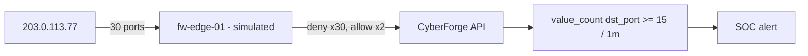

<!-- Generated from lab.yaml by `pnpm content:labs`. Edit lab.yaml, not this file. -->

# Lab 11 - Network Reconnaissance Detection

**Beginner** · 30 min · Network Defense · `network` · MITRE: `T1046`, `T1595.001`

Detect a port scan in firewall logs by counting distinct denied ports per source, and see why counting distinct values beats counting events.

## Objectives
- Describe what a port scan is and what it looks like in firewall logs.
- Explain why a value-count correlation is more reliable than an event-count threshold for scans.
- Distinguish reconnaissance from a service simply being retried.
- Use the outcome of the scan (which probes were allowed) to gauge exposure.

## Scenario
Ordinary users reach the DMZ web server on HTTPS. A single external address then probes thirty consecutive ports in thirty seconds, and two probes (SSH and HTTP) get through. Find the scan, size its success, and decide what to tighten.

## Architecture
A simulated edge firewall emits allow and deny records. CyberForge evaluates a Sigma correlation rule that counts distinct destination ports denied per source address.

| Component | Role | Network |
| --- | --- | --- |
| fw-edge-01 | Simulated perimeter firewall | `none` |
| CyberForge API | Runs the correlation rule | `backend` |

## Lab setup

1. Open this lab in CyberForge and select Run simulation.
2. Open the port scan alert and inspect the distinct ports in the related events.

## Telemetry

- **Firewall connection log** (`network/firewall`): Source, destination, port and verdict for each connection.

The simulated events live in [`telemetry/scenario.jsonl`](telemetry/scenario.jsonl).

## Attack simulation

The simulation replays baseline HTTPS traffic, a thirty-port sequential scan with every probe denied, and two follow-up probes that reach open services. No packets are sent anywhere.

1. **Baseline** - Repeated HTTPS allows from a normal client.
2. **Scan** - One source, thirty distinct ports, all denied, one per second.
3. **Service discovery** - Two probes to SSH and HTTP are allowed: the attacker now knows what is open.

## Expected detection

The port scan rule alerts when one source is denied on fifteen or more distinct ports within a minute.

- `net-port-scan-burst`

## Investigation questions

1. How many distinct ports did the scanner probe and how many were allowed?
   

Hint and answer

   *Hint:* Group the source's events by verdict.

   *Answer:* Thirty were denied and two (22 and 80) were allowed.

   

2. Why is the count of distinct ports a better signal than the count of denied events?
   

Hint and answer

   *Hint:* Imagine a broken client retrying one closed port.

   *Answer:* A retry loop produces many events but one port; a scan produces many ports. Distinct ports separate the two.

   

## Mitigation
- Expose only required services and restrict administrative ports such as SSH to known ranges or a VPN.
- Rate-limit and auto-block sources that trip scan detection at the firewall.
- Alert on scans that succeed against any port, not just on scans.
- Baseline internal scanners and allow-list them in the rule.

## Cleanup
- Nothing to clean up: this lab runs entirely from telemetry.

## References

- [MITRE ATT&CK T1046 Network Service Discovery](https://attack.mitre.org/techniques/T1046/)
- [Sigma correlation rules](https://sigmahq.io/docs/meta/correlations.html)

## Safety

Scope: `simulation-only` · Network: `none`. This lab only ever targets isolated CyberForge lab systems or synthetic data. See the [security model](../../../docs/security-model.md).
