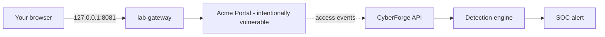

<!-- Generated from lab.yaml by `pnpm content:labs`. Edit lab.yaml, not this file. -->

# Lab 01 - Broken Authentication

**Beginner** · 30 min · Authentication · `web` · MITRE: `T1110.001`, `T1078`

Watch a login form with no lockout or throttling fall to scripted password guessing, then learn what the telemetry looks like and how to detect it.

## Objectives
- Explain why a login endpoint without lockout, throttling or MFA is exposed to online guessing.
- Recognise the telemetry pattern of scripted credential guessing in web access logs.
- Read a Sigma correlation rule and explain how it turns many weak events into one strong alert.
- Propose layered mitigations that do not rely on the attacker being slow.

## Scenario
Acme runs a customer portal. Its login page accepts unlimited attempts. A remote client starts guessing passwords for the account jsmith. Your job is to see the attack in the access log, decide when it became a compromise, and design a control that would have stopped it.

## Architecture
Acme Portal is an intentionally vulnerable web application that runs only on an isolated Docker network. A gateway bound to 127.0.0.1 is the only way to reach it from your machine. The portal sends its access events to the CyberForge API, where the detection engine evaluates Sigma rules.

| Component | Role | Network |
| --- | --- | --- |
| Acme Portal | Intentionally vulnerable target application | `lab-internal` |
| lab-gateway | Localhost-only reverse proxy into the lab network | `host-localhost` |
| CyberForge API | Receives lab telemetry and runs detections | `backend` |

## Lab setup

1. Start the lab network: `docker compose --profile labs up -d lab-vuln-web lab-gateway`.
2. Open http://127.0.0.1:8081 (bound to localhost only) to see the Acme Portal.
3. Prefer not to run containers? Use Run simulation in CyberForge: it replays the same telemetry.

## Telemetry

- **Portal access log** (`web/webserver`): One record per HTTP request with client address, method, path and status.

The simulated events live in [`telemetry/scenario.jsonl`](telemetry/scenario.jsonl).

## Attack simulation

The simulation replays a burst of rejected logins followed by one accepted login from a single client address. In live mode you generate the same pattern yourself against the lab portal only.

1. **Baseline** - Log in once with a wrong password and once correctly. Note the 401 and 200 responses.
2. **Guess repeatedly** - Submit the login form a dozen times in quick succession with different passwords for the same account. The portal never slows you down.
3. **Compare with a real user** - A person needs several seconds per attempt; a script needs milliseconds. The spacing in the log is the tell.

## Expected detection

A Sigma correlation rule counts rejected logins per client address. Ten failures inside a minute raise a high-severity alert mapped to Brute Force: Password Guessing.

- `web-login-brute-force-burst`

## Investigation questions

1. How many failed attempts preceded the successful login, and over what time span?
   

Hint and answer

   *Hint:* Filter events to the client address and sort by time.

   *Answer:* Twelve 401 responses over 24 seconds, then a 200 on the next request.

   

2. What single log field best distinguishes this client from a normal user?
   

Hint and answer

   *Hint:* Look at the user agent and the spacing between requests.

   *Answer:* The python-requests user agent and a two-second, machine-regular cadence.

   

3. Was the account compromised? What evidence would confirm it?
   

Hint and answer

   *Hint:* What did the client do after the 200?

   *Answer:* Yes, likely. The same address read /account/profile with the new session. Confirm by checking for data access and resetting the credential.

   

## Mitigation
- Enforce progressive delays or temporary lockout per account and per source address.
- Require multi-factor authentication for all accounts, especially privileged ones.
- Reject known-breached passwords at registration and password change.
- Alert on failure bursts and on a success that follows them.

## Cleanup
- Stop the lab: `docker compose --profile labs down`.
- Delete simulated alerts from the SOC view if you want a clean dashboard (optional).

## References

- [MITRE ATT&CK T1110.001 Password Guessing](https://attack.mitre.org/techniques/T1110/001/)
- [OWASP Authentication Cheat Sheet](https://cheatsheetseries.owasp.org/cheatsheets/Authentication_Cheat_Sheet.html)

## Safety

Scope: `local-container` · Network: `lab-internal`. This lab only ever targets isolated CyberForge lab systems or synthetic data. See the [security model](../../../docs/security-model.md).
