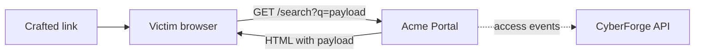

<!-- Generated from lab.yaml by `pnpm content:labs`. Edit lab.yaml, not this file. -->

# Lab 03 - Cross-Site Scripting

**Beginner** · 35 min · Injection · `web` · MITRE: `T1059.007`, `T1190`

Understand reflected XSS end to end: how unescaped output runs attacker script in a victim's browser, how it appears in logs, and how output encoding fixes it.

## Objectives
- Explain the difference between reflected, stored and DOM-based XSS.
- Recognise XSS payloads in request logs and explain why the log can only show the attempt.
- Describe how context-aware output encoding and Content-Security-Policy work together.

## Scenario
An attacker cannot log in as a customer, but they can craft a link. When a logged-in customer follows it, the portal reflects the attacker's markup back and the customer's browser runs it in the portal's origin. You will trace the payload and its delivery through the logs.

## Architecture
The Acme Portal echoes the search term and profile name into HTML without encoding. Scripts run in your own browser against the local lab origin only; there is no third-party target.

| Component | Role | Network |
| --- | --- | --- |
| Acme Portal | Reflects unencoded input into HTML (intentional flaw) | `lab-internal` |
| lab-gateway | Localhost-only reverse proxy | `host-localhost` |
| CyberForge API | Receives telemetry, evaluates Sigma rules | `backend` |

## Lab setup

1. Start the lab: `docker compose --profile labs up -d lab-vuln-web lab-gateway`.
2. Open http://127.0.0.1:8081/search and search for a harmless string to confirm it is echoed back.
3. Or run the simulation in CyberForge to replay the telemetry.

## Telemetry

- **Portal access log** (`web/webserver`): Requests with query strings and referrers.

The simulated events live in [`telemetry/scenario.jsonl`](telemetry/scenario.jsonl).

## Attack simulation

The simulation replays a script-tag payload, an attribute-breaking event-handler payload, and the same payload arriving from a different client through an emailed link.

1. **Prove reflection** - Search for a distinctive word and view the page source to see where it lands in the HTML.
2. **Break out of context** - Use a payload that matches the context (element body versus attribute) and observe the browser executing it in the lab origin.
3. **Deliver** - Share the crafted URL. In the log the payload appears from a second client with an email referrer.

## Expected detection

The XSS rule flags script tags, inline event handlers and javascript: URIs in query strings. It detects the attempt; whether it worked depends on the response, which the access log does not contain.

- `web-xss-payload-in-request`

## Investigation questions

1. Which clients sent the payload, and which of them is likely a victim rather than the attacker?
   

Hint and answer

   *Hint:* Compare client addresses, user agents and the referrer header.

   *Answer:* 203.0.113.55 crafted the payloads; 10.20.5.30 sent the identical request from an internal address with an email referrer, so it is a victim who followed the link.

   

2. Why can the access log not tell you whether the XSS executed?
   

Hint and answer

   *Hint:* What does the server log versus what the browser does?

   *Answer:* Execution happens in the browser after the response. The log shows only the request and response status and size.

   

## Mitigation
- Encode output for its context (HTML body, attribute, JavaScript, URL); prefer templating engines with auto-escaping.
- Set a strict Content-Security-Policy that disallows inline scripts.
- Mark session cookies HttpOnly and SameSite to limit what injected script can steal.
- Validate input as a secondary control, never as the only defence.

## Cleanup
- Stop the lab: `docker compose --profile labs down`.

## References

- [OWASP XSS Prevention Cheat Sheet](https://cheatsheetseries.owasp.org/cheatsheets/Cross_Site_Scripting_Prevention_Cheat_Sheet.html)
- [MITRE ATT&CK T1059.007 JavaScript](https://attack.mitre.org/techniques/T1059/007/)

## Safety

Scope: `local-container` · Network: `lab-internal`. This lab only ever targets isolated CyberForge lab systems or synthetic data. See the [security model](../../../docs/security-model.md).
