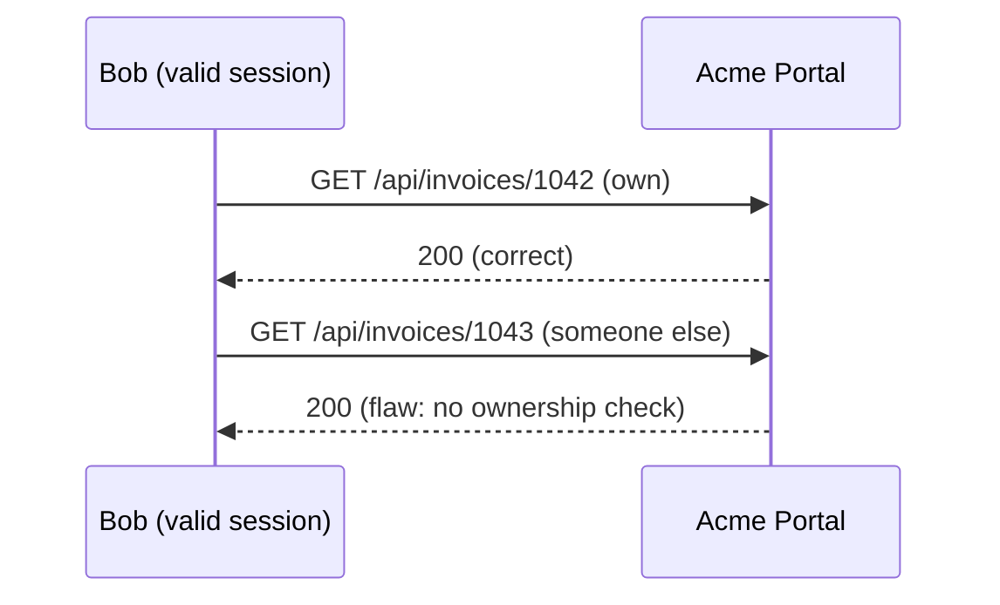

<!-- Generated from lab.yaml by `pnpm content:labs`. Edit lab.yaml, not this file. -->

# Lab 04 - IDOR / Broken Access Control

**Intermediate** · 40 min · Access Control · `web` · MITRE: `T1190`, `T1213`

Find an insecure direct object reference by reading logs, then contrast authentication ("who are you") with authorisation ("may you see this").

## Objectives
- Explain the difference between authentication and authorisation with a concrete failure.
- Spot enumeration in access logs by counting distinct object identifiers per client.
- Describe object-level authorisation checks and why sequential identifiers make the flaw easier to exploit.

## Scenario
Bob is a legitimate customer. After viewing his own invoice he changes the number in the URL and keeps reading. Every response is 200. From the server's perspective nothing failed, which is precisely the problem: only a correlation across requests reveals the abuse.

## Architecture
The Acme Portal exposes /api/invoices/{id}. It requires a valid session but never checks that the invoice belongs to the caller. Data is fake and held in memory inside the lab network.

| Component | Role | Network |
| --- | --- | --- |
| Acme Portal | Invoice API without object-level authorisation (intentional flaw) | `lab-internal` |
| lab-gateway | Localhost-only reverse proxy | `host-localhost` |
| CyberForge API | Receives telemetry, evaluates Sigma rules | `backend` |

## Lab setup

1. Start the lab: `docker compose --profile labs up -d lab-vuln-web lab-gateway`.
2. Log in to the portal as the demo user shown on its home page and open your invoice.
3. Or run the simulation in CyberForge to replay the telemetry.

## Telemetry

- **Portal access log** (`web/webserver`): Requests with path, status and authenticated user.

The simulated events live in [`telemetry/scenario.jsonl`](telemetry/scenario.jsonl).

## Attack simulation

The simulation replays one legitimate invoice read followed by fifteen sequential reads of other customers' invoices from the same session.

1. **Read your own record** - Open your invoice and note the numeric identifier in the URL.
2. **Change the identifier** - Request the next number. A correct application returns 403 or 404; the lab portal returns the data.
3. **Enumerate** - Repeat for a range of identifiers. Count how many distinct objects one session touched.

## Expected detection

A value-count correlation rule alerts when one client reads ten or more distinct invoice URLs in a minute, a pattern normal customers never produce.

- `web-object-id-enumeration`

## Investigation questions

1. Which request was the first unauthorised access?
   

Hint and answer

   *Hint:* Find where the identifier stops matching the user's own invoice.

   *Answer:* GET /api/invoices/1043, the first identifier after the user's own 1042.

   

2. Why is a WAF unlikely to catch this?
   

Hint and answer

   *Hint:* Is any single request malformed?

   *Answer:* Each request is syntactically valid and authenticated; the abuse is only visible in the pattern.

   

## Mitigation
- Check object ownership or role on every request server-side; deny by default.
- Use non-guessable identifiers (UUIDs) as defence in depth, not as the access control.
- Log the authenticated user and object identifier so anomalies can be correlated.
- Alert on distinct-object counts per session.

## Cleanup
- Stop the lab: `docker compose --profile labs down`.

## References

- [OWASP Top 10 A01 Broken Access Control](https://owasp.org/Top10/A01_2021-Broken_Access_Control/)
- [OWASP Insecure Direct Object Reference Prevention](https://cheatsheetseries.owasp.org/cheatsheets/Insecure_Direct_Object_Reference_Prevention_Cheat_Sheet.html)

## Safety

Scope: `local-container` · Network: `lab-internal`. This lab only ever targets isolated CyberForge lab systems or synthetic data. See the [security model](../../../docs/security-model.md).
