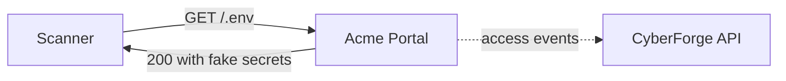

<!-- Generated from lab.yaml by `pnpm content:labs`. Edit lab.yaml, not this file. -->

# Lab 06 - Secrets Exposure

**Beginner** · 30 min · Configuration · `web` · MITRE: `T1552.001`, `T1595.002`

Learn how secrets leak through web-served files and URLs, how scanners find them within minutes, and how to respond when one is exposed.

## Objectives
- List the common ways secrets end up on a web server or in logs.
- Recognise sensitive-file probes in access logs and judge success from the response.
- Apply the correct response to an exposed secret: rotate first, investigate second.

## Scenario
An internet-wide scanner requests a fixed list of files known to leak secrets. One of them exists. Separately, an internal reporting client passes its API key in the query string. You must decide which exposures matter most and what to do about each.

## Architecture
The Acme Portal accidentally serves an environment file and version-control metadata from its web root. The secrets in these files are obviously fake and carry a CyberForge canary marker.

| Component | Role | Network |
| --- | --- | --- |
| Acme Portal | Serves files it should not (intentional flaw) | `lab-internal` |
| lab-gateway | Localhost-only reverse proxy | `host-localhost` |
| CyberForge API | Receives telemetry, evaluates Sigma rules | `backend` |

## Lab setup

1. Start the lab: `docker compose --profile labs up -d lab-vuln-web lab-gateway`.
2. Request http://127.0.0.1:8081/.env from your browser and read the canary-marked fake values.
3. Or run the simulation in CyberForge to replay the telemetry.

## Telemetry

- **Portal access log** (`web/webserver`): Requests with status and response size.

The simulated events live in [`telemetry/scenario.jsonl`](telemetry/scenario.jsonl).

## Attack simulation

The simulation replays a scanner walking a list of sensitive paths, with one hit on .env and .git/config, and an internal client that places an API key in a URL.

1. **Probe common paths** - Request /robots.txt, /.env and /.git/config. Compare status codes and response sizes.
2. **Read what leaked** - The fake .env holds canary-marked values that show what a real leak would contain.
3. **Find secrets in URLs** - Search the log for api_key= and similar parameters.

## Expected detection

The sensitive-file rule matches requests for well-known leak paths; the URL-secret rule flags credentials sent in query strings. Neither knows if the file existed, so check the status code.

- `web-sensitive-file-probe`
- `web-secret-in-url-query`

## Investigation questions

1. Which probes succeeded and what was the exposure?
   

Hint and answer

   *Hint:* Look for 200 status and non-trivial response sizes.

   *Answer:* /.env (412 bytes) and /.git/config (298 bytes) returned 200; /config.php.bak returned 404.

   

2. What is the first action once you confirm /.env was served?
   

Hint and answer

   *Hint:* Assume the attacker has already copied it.

   *Answer:* Rotate every credential in the file immediately, then remove the file, then review access made with those credentials.

   

## Mitigation
- Never deploy dotfiles or backups to the web root; serve only an explicit allow-list of paths.
- Keep secrets in a secret manager or runtime environment, not in files inside the application tree.
- Send credentials in headers, not URLs.
- Add secret scanning to CI and pre-commit hooks.

## Cleanup
- Stop the lab: `docker compose --profile labs down`.

## References

- [MITRE ATT&CK T1552.001 Credentials In Files](https://attack.mitre.org/techniques/T1552/001/)
- [OWASP Secrets Management Cheat Sheet](https://cheatsheetseries.owasp.org/cheatsheets/Secrets_Management_Cheat_Sheet.html)

## Safety

Scope: `local-container` · Network: `lab-internal`. This lab only ever targets isolated CyberForge lab systems or synthetic data. See the [security model](../../../docs/security-model.md).
