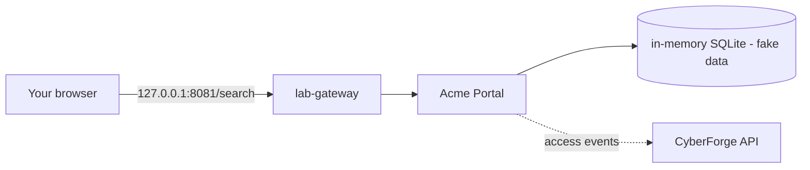

<!-- Generated from lab.yaml by `pnpm content:labs`. Edit lab.yaml, not this file. -->

# Lab 02 - SQL Injection Fundamentals

**Beginner** · 40 min · Injection · `web` · MITRE: `T1190`, `T1595.002`

See how string-built SQL lets input change a query, what that looks like in web logs, and how parameterised queries remove the problem.

## Objectives
- Explain how concatenating user input into SQL changes the meaning of the query.
- Identify tautology, UNION and time-delay probes in access logs.
- Use response size and status to judge whether a probe succeeded.
- Describe why parameterised queries fix the root cause and WAF rules do not.

## Scenario
A retailer's product search is exposed to the internet. An outsider notices that a stray quote in the search box produces an error, then escalates from a tautology to data extraction using an automated tool. You will read the logs from the defender's chair.

## Architecture
The Acme Portal search page builds a SQL query by concatenating the search term. The database is an in-memory SQLite instance seeded with fake products and users, so nothing real can be exposed. The portal runs on the isolated lab network and reports its requests to the CyberForge API.

| Component | Role | Network |
| --- | --- | --- |
| Acme Portal | Search endpoint that concatenates SQL (intentional flaw) | `lab-internal` |
| lab-gateway | Localhost-only reverse proxy | `host-localhost` |
| CyberForge API | Receives telemetry, evaluates Sigma rules | `backend` |

## Lab setup

1. Start the lab: `docker compose --profile labs up -d lab-vuln-web lab-gateway`.
2. Open http://127.0.0.1:8081/search and try a normal search such as `laptop`.
3. Or run the simulation in CyberForge to replay the telemetry without containers.

## Telemetry

- **Portal access log** (`web/webserver`): Requests including the raw query string.

The simulated events live in [`telemetry/scenario.jsonl`](telemetry/scenario.jsonl).

## Attack simulation

The simulation replays a normal search, a boolean tautology, a UNION extraction attempt, and a burst of time-delay probes from an automated scanner. All targets are the lab's fake database.

1. **Break the query** - Enter a single quote in the search box. An error or odd result means input reached the SQL parser.
2. **Tautology** - Submit a term that makes the WHERE clause always true. Compare the response size with the baseline.
3. **Extraction** - Append a UNION SELECT against the users table of the fake database and observe how the result page changes.
4. **Automation** - A scanner user agent and repeated time-delay probes distinguish tooling from a curious human.

## Expected detection

The SQL injection rule matches tautology, UNION, schema and time-delay strings in raw and URL-encoded form. A scanner user-agent rule adds context when a tool is driving.

- `web-sql-injection-probe`
- `web-scanner-user-agent`

## Investigation questions

1. Which request most likely returned data it should not have?
   

Hint and answer

   *Hint:* Compare response sizes across requests to the same path.

   *Answer:* The tautology request returned 48,213 bytes against a 3,120-byte baseline, so it likely dumped many rows.

   

2. How can you tell the later probes were automated?
   

Hint and answer

   *Hint:* Look at the user agent and repetition.

   *Answer:* The user agent names a well-known scanner and the same time-delay probe repeats at fixed intervals.

   

3. Does a WAF block fix this vulnerability?
   

Hint and answer

   *Hint:* Think about what the WAF sees versus what the application does.

   *Answer:* No. It may block known strings but the flaw remains; parameterised queries remove it.

   

## Mitigation
- Use parameterised queries or an ORM for every database call; never concatenate input into SQL.
- Run the application with a least-privilege database account with no access to unrelated tables.
- Return generic error messages and log details server-side.
- Alert on injection strings as a tripwire, not as the primary control.

## Cleanup
- Stop the lab: `docker compose --profile labs down`.

## References

- [OWASP SQL Injection Prevention Cheat Sheet](https://cheatsheetseries.owasp.org/cheatsheets/SQL_Injection_Prevention_Cheat_Sheet.html)
- [MITRE ATT&CK T1190 Exploit Public-Facing Application](https://attack.mitre.org/techniques/T1190/)

## Safety

Scope: `local-container` · Network: `lab-internal`. This lab only ever targets isolated CyberForge lab systems or synthetic data. See the [security model](../../../docs/security-model.md).
