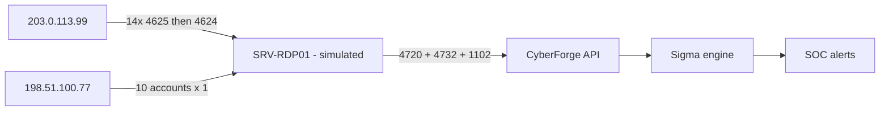

<!-- Generated from lab.yaml by `pnpm content:labs`. Edit lab.yaml, not this file. -->

# Lab 14 - Brute Force Detection

**Intermediate** · 50 min · Authentication · `windows-sim` · MITRE: `T1110.001`, `T1110.003`, `T1021.001`, `T1078`, `T1136.001`, `T1098`, `T1685.005`

Detect password guessing and password spraying on Windows, then follow an intruder who gets in through RDP, adds an administrator and clears the log.

## Objectives
- Tell brute force (one account, many passwords) from password spraying (many accounts, few passwords) in Event 4625 data.
- Build correlation rules that count events and distinct values.
- Recognise post-compromise account and log manipulation events.
- Sequence the events into an incident timeline.

## Scenario
An RDP server is reachable from the internet. One address guesses the administrator password fourteen times and then logs in; another tries ten accounts once each. After logging in, the intruder creates a new account, adds it to Administrators and clears the Security log.

## Architecture
A simulated RDP server emits Windows Security events. CyberForge applies five Sigma rules, three of them correlations, to separate guessing, spraying, a successful public RDP logon, a backdoor administrator, and log clearing.

| Component | Role | Network |
| --- | --- | --- |
| SRV-RDP01 | Simulated Windows RDP host | `none` |
| CyberForge API | Correlates and alerts | `backend` |

## Lab setup

1. Open this lab in CyberForge and select Run simulation.
2. Compare the guessing alert with the spraying alert: which field differs?

## Telemetry

- **Windows Security log** (`windows/security`): 4625 failed logon, 4624 logon, 4720 account created, 4732 group change, 1102 log cleared.

The simulated events live in [`telemetry/scenario.jsonl`](telemetry/scenario.jsonl).

## Attack simulation

The simulation replays guessing, a successful RDP logon, a spraying pattern, account creation and promotion, and log clearing. All addresses are documentation ranges and nothing connects anywhere.

1. **Guess one account** - Fourteen failures for administrator from one address in under a minute.
2. **Get in** - A logon type 10 (RDP) from a public address succeeds.
3. **Spray many accounts** - Another address tries ten different user names once each.
4. **Entrench** - Create backupadmin, add it to Administrators, clear the Security log.

## Expected detection

Failed-logon burst, password spraying, public RDP logon, local admin creation and log clearing each raise their own alert, together forming the incident.

- `win-failed-logon-burst`
- `win-password-spraying-pattern`
- `win-rdp-logon-from-public-address`
- `win-local-admin-account-created`
- `win-security-log-cleared`

## Investigation questions

1. Which source is guessing and which is spraying, and what field proves it?
   

Hint and answer

   *Hint:* Count distinct TargetUserName per source.

   *Answer:* 203.0.113.99 targets one account repeatedly (guessing); 198.51.100.77 targets ten accounts once each (spraying).

   

2. How long after the RDP logon was the backdoor administrator created?
   

Hint and answer

   *Hint:* Compare the 4624 and 4720 timestamps.

   *Answer:* About two minutes.

   

3. What can you no longer trust after Event 1102?
   

Hint and answer

   *Hint:* Think about what was cleared.

   *Answer:* Local Security log history before the clear; rely on forwarded logs and other sources to reconstruct earlier activity.

   

## Mitigation
- Never expose RDP directly to the internet; require a VPN or gateway with MFA.
- Enforce account lockout and smart-lockout policies suitable for spraying.
- Forward Security logs off-host in near real time so clearing does not erase evidence.
- Alert on privileged group changes and new local accounts.

## Cleanup
- Nothing to clean up: this lab runs entirely from telemetry.

## References

- [MITRE ATT&CK T1110.003 Password Spraying](https://attack.mitre.org/techniques/T1110/003/)
- [Microsoft audit logon events](https://learn.microsoft.com/windows/security/threat-protection/auditing/event-4625)

## Safety

Scope: `simulation-only` · Network: `none`. This lab only ever targets isolated CyberForge lab systems or synthetic data. See the [security model](../../../docs/security-model.md).
