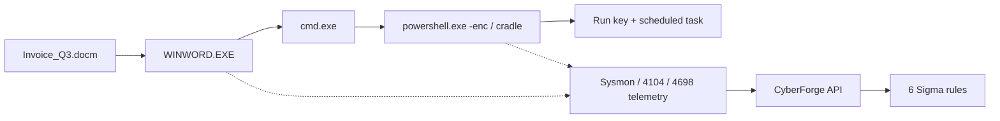

<!-- Generated from lab.yaml by `pnpm content:labs`. Edit lab.yaml, not this file. -->

# Lab 10 - Suspicious PowerShell Detection Simulation

**Intermediate** · 60 min · Endpoint Detection · `windows-sim` · MITRE: `T1059.001`, `T1027.010`, `T1105`, `T1204.002`, `T1140`, `T1547.001`, `T1053.005`

Follow a macro-driven PowerShell intrusion through parent-child relationships, encoded commands, download cradles, script block logging and persistence, then match each stage to a Sigma rule.

## Objectives
- Read process-creation events and explain why the Word to cmd to PowerShell chain is suspicious.
- Decode a Base64 -EncodedCommand argument (UTF-16LE) and interpret it.
- Explain why script block logging captures what command-line logging cannot.
- Map six detections to their MITRE techniques and explain their false positives.

## Scenario
A finance user opens a macro-enabled invoice. Word starts a command shell, which starts PowerShell with a hidden window and an encoded command, then a download cradle, then a script block that decodes and evaluates more content. Persistence is added through a Run key and a scheduled task.

## Architecture
A simulated Windows workstation emits Sysmon-style process creation, PowerShell script block, registry and Security log events. Nothing is executed: the payloads are harmless strings and the network addresses are documentation ranges.

| Component | Role | Network |
| --- | --- | --- |
| WKS-014 | Simulated Windows workstation | `none` |
| CyberForge API | Normalises telemetry, runs detections | `backend` |

## Lab setup

1. Open this lab in CyberForge and select Run simulation.
2. Open the PowerShell alert and step through the lifecycle view from raw event to mitigation.
3. Decode the -enc value yourself: Base64 decode, then interpret the bytes as UTF-16LE.

## Telemetry

- **Sysmon process creation** (`windows/process_creation`): Image, command line and parent for every process start.
- **PowerShell script block log** (`windows/ps_script`): Decoded script text (Event 4104).
- **Registry and Security logs** (`windows/registry_set`): Run key writes and scheduled task creation (4698).

The simulated events live in [`telemetry/scenario.jsonl`](telemetry/scenario.jsonl).

## Attack simulation

The simulation replays seven telemetry events. The encoded payload decodes to a harmless Write-Output line and the cradle points at a documentation-range address, so the chain is realistic to read yet inert.

1. **Document opened** - A macro-enabled file opens in Word from the Downloads folder.
2. **Shell spawned** - Word starts cmd.exe, which starts PowerShell hidden with an encoded command.
3. **Second stage** - A download cradle fetches text and evaluates it.
4. **Decoded logic** - Script block logging records the decoded script.
5. **Persistence** - A Run key and a scheduled task re-launch the script.

## Expected detection

Six Sigma rules fire across the chain: Office spawning a shell, encoded PowerShell, download cradle, script block decode and execute, Run key persistence, and a scheduled task with a script payload.

- `win-office-application-spawns-shell`
- `win-encoded-powershell-command`
- `win-powershell-download-cradle`
- `win-powershell-scriptblock-decode-execute`
- `win-run-key-persistence-set`
- `win-scheduled-task-with-script-payload`

## Investigation questions

1. What did the encoded command actually do?
   

Hint and answer

   *Hint:* Base64 decode, then decode as UTF-16LE.

   *Answer:* It decodes to a Write-Output line saying it is a harmless CyberForge simulation.

   

2. Which detection gives the earliest warning and why?
   

Hint and answer

   *Hint:* Order the alerts by time.

   *Answer:* Office spawning a shell fires first, because the parent-child relationship is wrong before any payload runs.

   

3. Which detections would survive an attacker who removes the -enc flag?
   

Hint and answer

   *Hint:* Which rules do not depend on the encoding?

   *Answer:* The Office parent-child rule, the download cradle rule, script block logging and both persistence rules.

   

## Mitigation
- Block or restrict Office macros from the internet and enable Attack Surface Reduction rules for Office child processes.
- Enable PowerShell script block logging and Constrained Language Mode where feasible.
- Restrict scheduled task and Run key creation for standard users where possible; alert on the rest.
- Use application control to block script hosts you do not need.

## Cleanup
- Nothing to clean up: this lab runs entirely from telemetry.

## References

- [MITRE ATT&CK T1059.001 PowerShell](https://attack.mitre.org/techniques/T1059/001/)
- [Microsoft PowerShell logging documentation](https://learn.microsoft.com/powershell/module/microsoft.powershell.core/about/about_logging_windows)
- [Sigma rule specification](https://sigmahq.io/docs/basics/rules.html)

## Safety

Scope: `simulation-only` · Network: `none`. This lab only ever targets isolated CyberForge lab systems or synthetic data. See the [security model](../../../docs/security-model.md).
