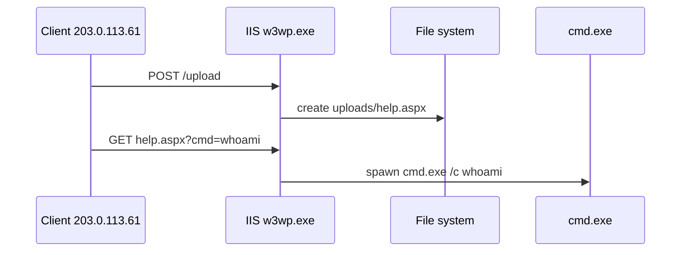

<!-- Generated from lab.yaml by `pnpm content:labs`. Edit lab.yaml, not this file. -->

# Lab 13 - Web Shell Telemetry Analysis

**Advanced** · 60 min · Endpoint Detection · `windows-sim` · MITRE: `T1505.003`, `T1190`

Correlate web logs, file events and process events on an IIS server to prove a web shell exists, then trace what the operator did with it.

## Objectives
- Explain how a web shell differs from an ordinary web application in host telemetry.
- Join three telemetry sources (web request, file creation, process creation) into one timeline.
- Use timing to link an HTTP request to the process it caused.
- List containment steps that preserve evidence.

## Scenario
A file upload form on an IIS server does not validate file types. Moments after an upload, a new .aspx file appears in the uploads directory, the file is requested with a command parameter, and cmd.exe starts as a child of the web server process. Prove it and scope it.

## Architecture
A simulated IIS host emits web access logs, Sysmon file and process events. CyberForge correlates them into one alert story. No web shell code exists anywhere in the repository; only telemetry describing one.

| Component | Role | Network |
| --- | --- | --- |
| IIS-WEB01 | Simulated IIS web server | `none` |
| CyberForge API | Runs detections across sources | `backend` |

## Lab setup

1. Open this lab in CyberForge and select Run simulation.
2. Open each alert and compare timestamps: the request, the file and the process line up within seconds.

## Telemetry

- **IIS access log** (`web/webserver`): Requests including query strings.
- **Sysmon file creation** (`windows/file_event`): File writes with the writing process.
- **Sysmon process creation** (`windows/process_creation`): Process starts with parent image.

The simulated events live in [`telemetry/scenario.jsonl`](telemetry/scenario.jsonl).

## Attack simulation

The simulation replays an upload, the resulting file write, a command request, and three child processes of the web server. It is a narrative in telemetry: nothing runs.

1. **Upload** - A POST to /upload returns 200 from an external client.
2. **File drop** - w3wp.exe writes help.aspx into the served uploads directory.
3. **Use** - The page is requested with cmd=whoami and cmd.exe appears under w3wp.exe one second later.
4. **Discovery** - net.exe and whoami.exe follow with account and privilege discovery commands.

## Expected detection

Three rules fire on different sources: the file drop, the request with a command parameter, and the web server spawning a shell. Any one is suggestive; all three together are conclusive.

- `win-webshell-file-written-in-webroot`
- `web-webshell-command-parameter-request`
- `win-webserver-spawns-shell`

## Investigation questions

1. What is the earliest event that proves compromise, and what came before it?
   

Hint and answer

   *Hint:* Order events across all three sources.

   *Answer:* The file write by w3wp.exe two seconds after the upload is the earliest host proof; the upload request preceded it.

   

2. How do you know the commands came from the web request and not a local user?
   

Hint and answer

   *Hint:* Compare the process parent, user and timing.

   *Answer:* The parent is w3wp.exe running as the app pool identity, one second after the request with cmd=whoami.

   

3. What must you do before deleting help.aspx?
   

Hint and answer

   *Hint:* Think about evidence.

   *Answer:* Preserve a copy and its timestamps, capture memory and logs, then remove it and fix the upload handler.

   

## Mitigation
- Validate uploads by content and extension, store them outside the web root, and never make upload directories executable.
- Run the application pool with least privilege and deny it write access to the web root.
- Monitor for new script files created by the web server process and for shells spawned by it.
- Patch or fix the vulnerable upload handler and review adjacent code.

## Cleanup
- Nothing to clean up: this lab runs entirely from telemetry.

## References

- [MITRE ATT&CK T1505.003 Web Shell](https://attack.mitre.org/techniques/T1505/003/)
- [OWASP File Upload Cheat Sheet](https://cheatsheetseries.owasp.org/cheatsheets/File_Upload_Cheat_Sheet.html)

## Safety

Scope: `simulation-only` · Network: `none`. This lab only ever targets isolated CyberForge lab systems or synthetic data. See the [security model](../../../docs/security-model.md).
